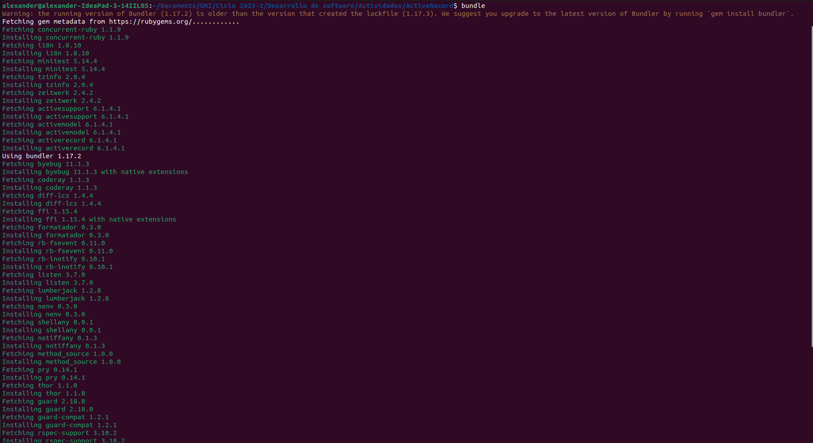
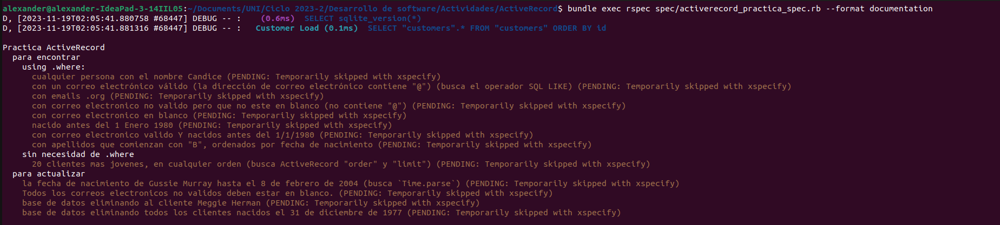
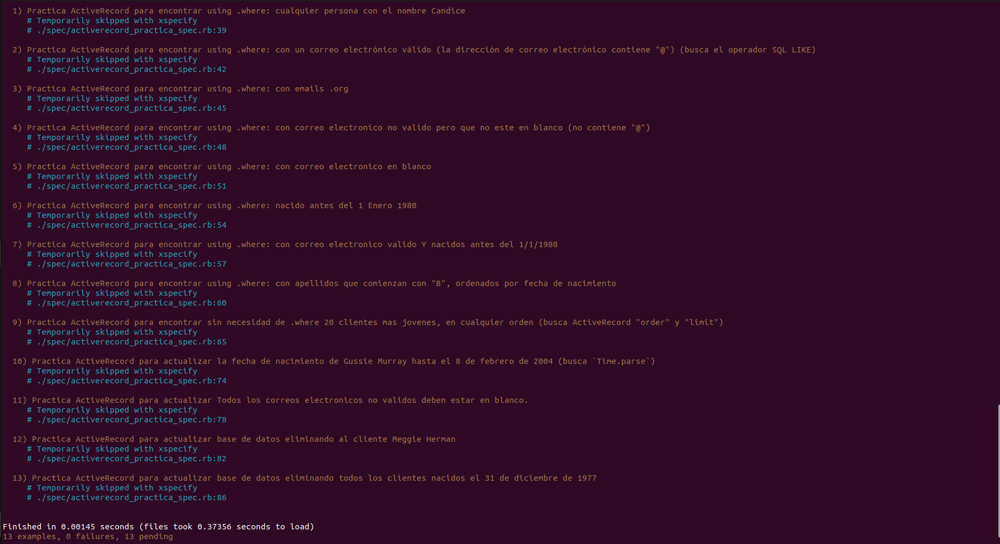
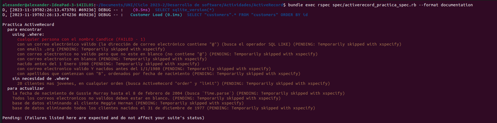
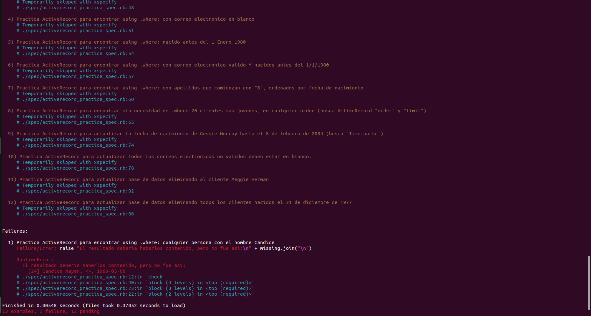
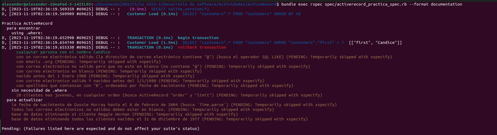
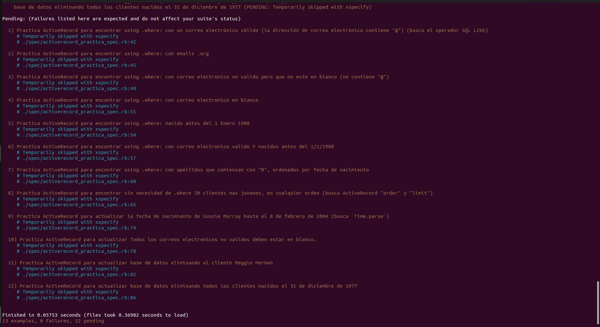
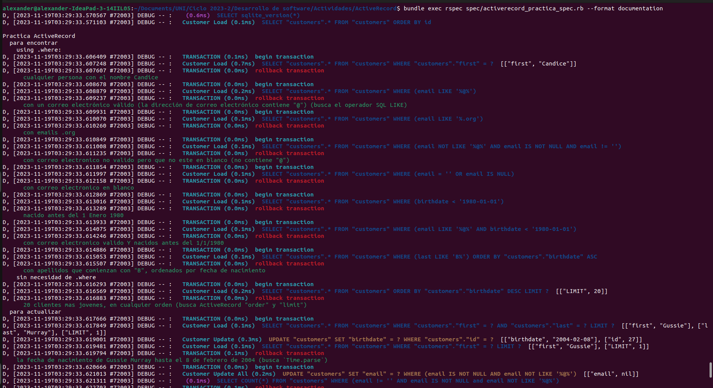
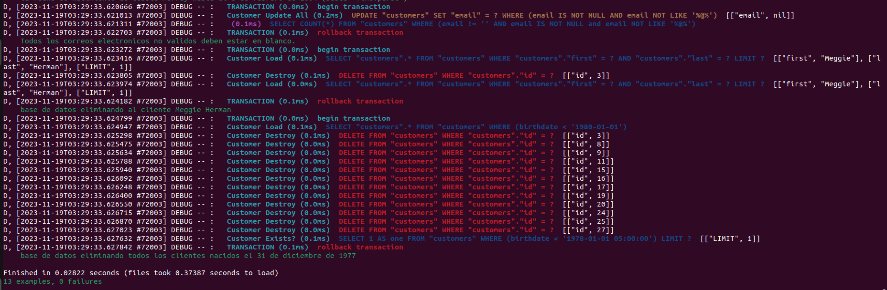

# Active Record
Ejecutamos bundle para asegurarse de tener las gemas necesaria


Ejecutamos el archivo de prueba con bundle exec rspec spec/activerecord_practice_spec.rb y el resultado debe ser 13 ejemplos, 0 fallas, 13 pendientes, pues todas las pruebas se están ignorando ya que se usó xspecify que es una especie de comentario para marcar pruebas como omitidas temporalmente.




Hemos configurado las pruebas para que inicialmente se omitan todas las pruebas. (Todos fallarían porque aún no has escrito el código para ellos). Abre el specfile y echa un vistazo. tu flujo de trabajo será el siguiente:

* Escoge un ejemplo para trabajar (recomendamos hacerlo en orden). Cada ejemplo (caso de prueba) comienza con xspecify.
* En ese ejemplo, cambia xspecify por specify y guarda el archivo. Este cambio hará que esa prueba en particular no se omita en la siguiente ejecución de prueba.
* La prueba fallará inmediatamente porque no has escrito el código necesario.
* Escribiras el código necesario y aprobarás la prueba, luego pasa al siguiente ejemplo.





EScribimos código necesario para que pase la primera prueba (debe estar en color verde)
``` ruby
def self.any_candice
    # Tu codigo aqui para devolver todos los clientes cuyo nombre sea Candice
    # probablemente algo asi:  Customer.where(....)
    Customer.where(first: 'Candice')
  end
```





Seguimos escribiendo código necesario para pasar todas las pruebas y ejecutamos el comando ```bundle exec rspec spec/activerecord_practice_spec.rb ```




