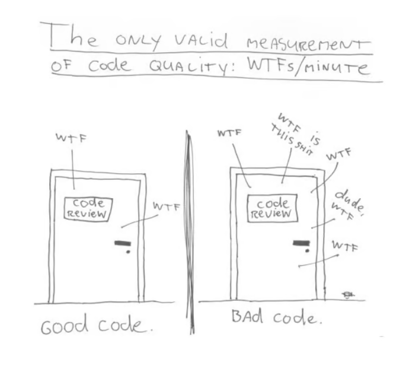
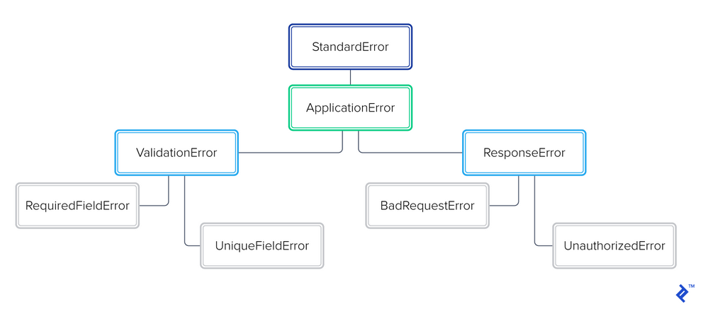

# Código limpio, manejo de excepciones, depuración
## Clean Code and the Art of Exception Handling
Vamos a utilizar el siguiente [tutorial para Ruby](https://www.toptal.com/abap/clean-code-and-the-art-of-exception-handling) en la actividad ActiveRecord.

Las excepciones son un elemento fundamental de la programación moderna y no hay nada que temer. Implemente estas mejores prácticas de manejo de excepciones para escribir código limpio que sea más fácil de mantener.
Las excepciones son tan antiguas como la programación misma. En los días en que la programación se realizaba en hardware o mediante lenguajes de programación de bajo nivel, se usaban excepciones para alterar el flujo del programa y evitar fallas de hardware. Hoy, Wikipedia define las excepciones como: ```condiciones anómalas o excepcionales que requieren un procesamiento especial, lo que a menudo cambia el flujo normal de ejecución del programa...``` Y que manejarlos requiere: ```construcciones de lenguajes de programación especializados o mecanismos de hardware informático.```

Por lo tanto, las excepciones requieren un tratamiento especial y una excepción no controlada puede provocar un comportamiento inesperado. Los resultados suelen ser espectaculares. En 1996, el famoso [fallo en el lanzamiento del cohete Ariane 5](https://en.wikipedia.org/wiki/Ariane_flight_V88#Launch_failure) se atribuyó a una excepción de desbordamiento no controlada. Los peores errores de software de la historia contienen algunos otros errores que podrían atribuirse a excepciones no controladas o mal controladas.

Con el tiempo, estos errores, y muchos otros (que tal vez no fueron tan dramáticos, pero sí catastróficos para los involucrados) contribuyeron a la impresión de que las excepciones son malas.

Pero las excepciones son un elemento fundamental de la programación moderna; existen para mejorar nuestro software. En lugar de temer las excepciones, deberíamos aceptarlas y aprender a beneficiarnos de ellas. En este artículo, **analizaremos cómo gestionar las excepciones de forma elegante y utilizarlas para escribir código limpio que sea más fácil de mantener**.

### Exception Handling: It’s a Good Thing
Con el auge de la programación orientada a objetos (POO), el soporte de excepciones se ha convertido en un elemento crucial de los lenguajes de programación modernos. Hoy en día, la mayoría de los lenguajes cuentan con un sólido sistema de manejo de excepciones. Por ejemplo, Ruby proporciona el siguiente patrón típico:
``` ruby
begin
  do_something_that_might_not_work!
rescue SpecificError => e
  do_some_specific_error_clean_up
  retry if some_condition_met?
ensure
  this_will_always_be_executed
end
```
No hay nada malo con el código anterior. Pero el uso excesivo de estos patrones provocará errores en el código y no necesariamente será beneficioso. Del mismo modo, hacer un mal uso de ellos puede causar mucho daño a su código base, haciéndolo frágil u ofuscando la causa de los errores.

El estigma que rodea a las excepciones a menudo hace que los programadores se sientan perdidos. Es una realidad que las excepciones no se pueden evitar, pero a menudo se nos enseña que deben abordarse con rapidez y decisión. Como veremos, esto no es necesariamente cierto. Más bien, deberíamos aprender el arte de manejar las excepciones con elegancia, haciéndolas armoniosas con el resto de nuestro código.

A continuación se presentan algunas prácticas recomendadas que le ayudarán a aceptar excepciones y hacer uso de ellas y de sus capacidades para mantener su código mantenible, extensible y legible:

* Mantenibilidad: nos permite encontrar y corregir fácilmente nuevos errores, sin temor a romper la funcionalidad actual, introducir más errores o tener que abandonar el código por completo debido al aumento de la complejidad con el tiempo.
* Extensibilidad: Nos permite agregar fácilmente a nuestra base de código, implementando requisitos nuevos o modificados sin romper la funcionalidad existente. La extensibilidad proporciona flexibilidad y permite un alto nivel de reutilización de nuestra base de código.
* Legibilidad: nos permite leer fácilmente el código y descubrir su propósito sin perder demasiado tiempo investigando. Esto es fundamental para descubrir errores y código no probado de manera eficiente.

Estos elementos son los factores principales de lo que podríamos llamar limpieza o calidad, que no es una medida directa en sí misma, sino el efecto combinado de los puntos anteriores, como se demuestra en este cómic:



Dicho esto, profundicemos en estas prácticas y veamos cómo cada una de ellas afecta esas tres medidas.

Nota: Presentaremos ejemplos de Ruby, pero todas las construcciones demostradas aquí tienen equivalentes en los lenguajes POO más comunes.

### Always create your own ```ApplicationError``` hierarchy
La mayoría de los lenguajes vienen con una variedad de clases de excepción, organizadas en una jerarquía de herencia, como cualquier otra clase de programación orientada a objetos. Para preservar la legibilidad, mantenibilidad y extensibilidad de nuestro código, es una buena idea **crear nuestro propio subárbol de excepciones específicas de la aplicación que extiendan la clase de excepción base**. Invertir algo de tiempo en estructurar lógicamente esta jerarquía puede resultar extremadamente beneficioso. Por ejemplo:

``` ruby
class ApplicationError < StandardError; end

# Validation Errors
class ValidationError < ApplicationError; end
class RequiredFieldError < ValidationError; end
class UniqueFieldError < ValidationError; end

# HTTP 4XX Response Errors
class ResponseError < ApplicationError; end
class BadRequestError < ResponseError; end
class UnauthorizedError < ResponseError; end
# ...
```


Tener un paquete de excepciones completo y extensible para nuestra aplicación facilita mucho el manejo de estas situaciones específicas de la aplicación. Por ejemplo, podemos decidir qué excepciones manejar de una manera más natural. Esto no sólo aumenta la legibilidad de nuestro código, sino que también aumenta la capacidad de mantenimiento de nuestras aplicaciones y bibliotecas (gemas).

Desde la perspectiva de la legibilidad, es mucho más fácil de leer:

``` ruby
rescue ValidationError => e
```

Que leer:


``` ruby
rescue RequiredFieldError, UniqueFieldError, ... => e
```

Desde la perspectiva de mantenibilidad, digamos, por ejemplo, que estamos implementando una API JSON y hemos definido nuestro propio ```ClientError``` con varios subtipos, para usarlo cuando un cliente envía una solicitud incorrecta. Si surge alguno de estos, la aplicación debe representar la representación JSON del error en su respuesta. Será más fácil arreglar o agregar lógica a un solo bloque que maneja ```ClientError```s en lugar de recorrer cada posible error del cliente e implementar el mismo código de controlador para cada uno. En términos de extensibilidad, si luego tenemos que implementar otro tipo de error del cliente, podemos confiar en que ya se manejará adecuadamente aquí.

Además, esto no nos impide implementar un manejo especial adicional para errores específicos del cliente anteriormente en la pila de llamadas, o alterar el mismo objeto de excepción en el camino:


``` ruby
# app/controller/pseudo_controller.rb
def authenticate_user!
  fail AuthenticationError if token_invalid? || token_expired?
  User.find_by(authentication_token: token)
rescue AuthenticationError => e
  report_suspicious_activity if token_invalid?
  raise e
end

def show
  authenticate_user!
  show_private_stuff!(params[:id])
rescue ClientError => e
  render_error(e)
end
```

Como puede ver, generar esta excepción específica no nos impidió poder manejarla en diferentes niveles, modificarla, volver a generarla y permitir que el controlador de la clase principal la resolviera.

**Dos cosas a tener en cuenta aquí:**

* No todos los idiomas admiten generar excepciones desde un controlador de excepciones.
* En la mayoría de los idiomas, generar una nueva excepción desde un controlador hará que la excepción original se pierda para siempre, por lo que es mejor volver a generar el mismo objeto de excepción (como en el ejemplo anterior) para evitar perder la pista de la causa original de la excepción. error. (A menos que esté haciendo esto intencionalmente).

### Never ```escue Exception```


## Error Handling and Debugging Techniques in JavaScript: Best Practices
Leemos el [tutorial para Java Script](https://codedamn.com/news/javascript/error-handling-debugging) y respondemos a la pregunta ¿Qué diferencias encuentras en el tutorial para Ruby y el tutorial para Java Script?


## How to Set Up a Microservices Architecture in Ruby: A Step-by-Step Guide
Leemos y replicamos el [tutorial](https://www.toptal.com/ruby/how-to-set-up-a-microservices-architecture) y respondemos a la pregunta ¿Cuales son las principales diferencias en utilizar una arquitectura orientada a Microservicios y la de Cliente-Servidor vista en clase con Rails?
