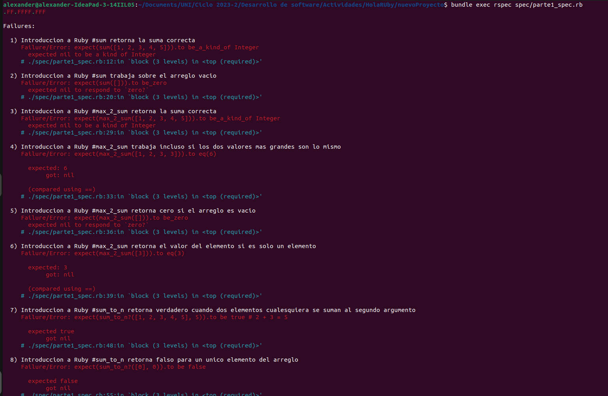
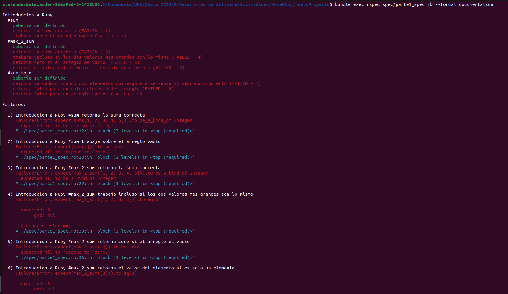
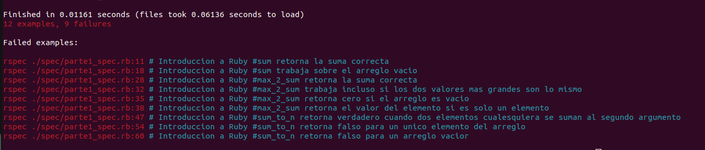
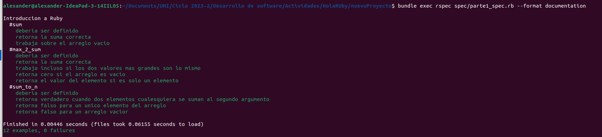
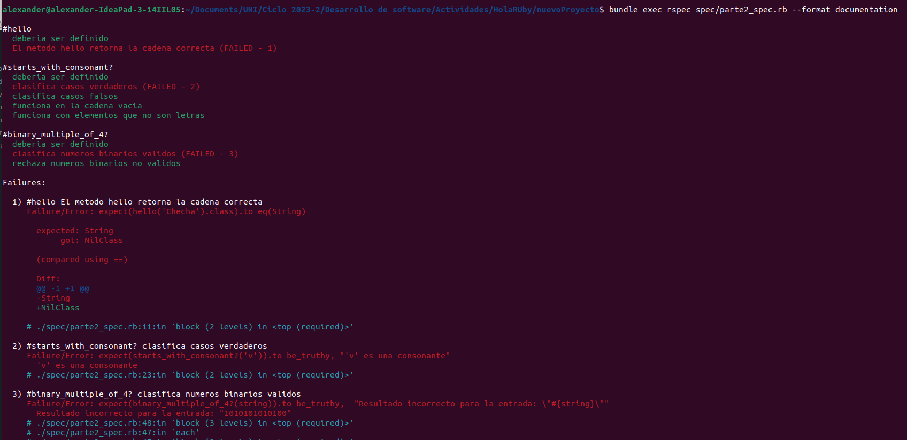
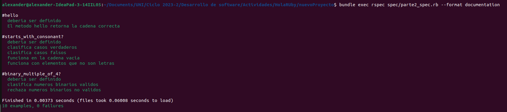
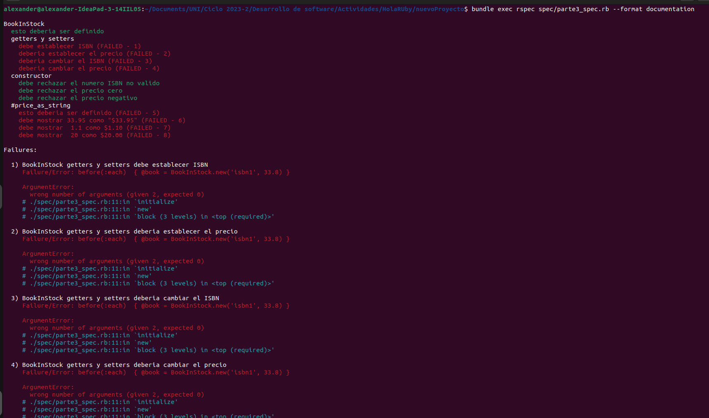
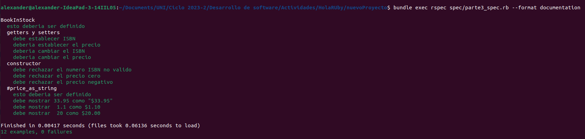

# Iniciando nuevo proyecto
Para iniciar un nuevo proyecto primero creamos un directorio llamado nuevoProyecto, luego debemos crear nuestro archivo Gemfile dentro de nuestro directorio nuevoProyecto con el siguiente comando:

``` ruby
bundle init 
``` 

Luego, abrimos el archivo Gemfile y agremos _gem "rspec"_. Ahora ejecutamos el siguiente comando desde directorio actual (nuevoProyecto) para installar las gemas en nuestro proyecto:

``` ruby
bundle install --path .bundle
```

Ahora creamos, en el directorio actual, las carpetas lib y spec. Copiamos el contenido de las carpetas lib y spec de esta actividad.
Para ejecutar las pruebas debemos escribir el siguiente comando:

``` ruby
bundle exec rspec spec/nombre_prueba_a_ejecutar_spec.rb
```

## Parte 1
Vamos a seguir el proceso Test-Driven Development (TDD). Nuestro archivo parte1_spec.rb contiene el siguiente código:

``` ruby
# frozen_string_literal: true

require_relative '../lib/ruby_intro.rb'

describe 'Introduccion a Ruby' do
  describe '#sum' do
    it 'deberia ser definido' do
      expect { sum([1, 3, 4]) }.not_to raise_error
    end

    it 'retorna la suma correcta'  do
      expect(sum([1, 2, 3, 4, 5])).to be_a_kind_of Integer
      expect(sum([1, 2, 3, 4, 5])).to eq(15)
      expect(sum([1, 2, 3, 4, -5])).to eq(5)
      expect(sum([1, 2, 3, 4, -5, 5, -100])).to eq(-90)
    end

    it 'trabaja sobre el arreglo vacio' do
      expect { sum([]) }.not_to raise_error
      expect(sum([])).to be_zero
    end
  end

  describe '#max_2_sum' do
    it 'deberia ser definido' do
      expect { max_2_sum([1, 2, 3]) }.not_to raise_error
    end
    it 'retorna la suma correcta'  do
      expect(max_2_sum([1, 2, 3, 4, 5])).to be_a_kind_of Integer
      expect(max_2_sum([1, -2, -3, -4, -5])).to eq(-1)
    end
    it 'trabaja incluso si los dos valores mas grandes son lo mismo' do
      expect(max_2_sum([1, 2, 3, 3])).to eq(6)
    end
    it 'retorna cero si el arreglo es vacio' do
      expect(max_2_sum([])).to be_zero
    end
    it 'retorna el valor del elemento si es solo un elemento' do
      expect(max_2_sum([3])).to eq(3)
    end
  end

  describe '#sum_to_n' do
    it 'deberia ser definido' do
      expect { sum_to_n?([1, 2, 3], 4) }.not_to raise_error
    end
    it 'retorna verdadero cuando dos elementos cualesquiera se suman al segundo argumento' do
      expect(sum_to_n?([1, 2, 3, 4, 5], 5)).to be true # 2 + 3 = 5
      expect(sum_to_n?([3, 0, 5], 5)).to be true # 0 + 5 = 5
      expect(sum_to_n?([-1, -2, 3, 4, 5, -8], -3)).to be true  # maneja la suma negativa
      expect(sum_to_n?([-1, -2, 3, 4, 5, -8], 12)).to be false # 3 + 4 + 5 = 12 
      expect(sum_to_n?([-1, -2, 3, 4, 6, -8], 12)).to be false # no dos elementos que sumar
    end
    it 'retorna falso para un unico elemento del arreglo' do
      expect(sum_to_n?([0], 0)).to be false
      expect(sum_to_n?([1], 1)).to be false
      expect(sum_to_n?([-1], -1)).to be false
      expect(sum_to_n?([-3], 0)).to be false
    end
    it 'retorna falso para un arreglo vacior' do
      expect(sum_to_n?([], 0)).to be false
      expect(sum_to_n?([], 7)).to be false
    end
  end
end
```

Y el código principal tiene las siguientes líneas de código:

``` ruby
# Parte 1

def sum arr
  # COMPLETA TU CODIGO
end

def max_2_sum arr
  # COMPLETA TU CODIGO
end

def sum_to_n? arr, n
  # COMPLETA TU CODIGO
end
```
Ejecutamos la primera prueba (parte1_spec.rb) y obtemos:




En la primera captura, observamos el resultado .FF.FFFF.FFF, esto significa que aquellas pruebas que pasaron están representadas por un punto verde (GREEN), las pruebas que fracasaron son representadas por la letra F en color rojo (RED). En la segunda captura, al usar _format documentation_ este resultado (.FF.FFFF.FFF) es más explícito (se visualiza mejor las pruebas que tuvieron éxito (color verde) y aquellas que fracasaron (color rojo)).  Aquellas pruebas que pasaron fueron las que solo pedían argumento(s) válido(s) (deberia ser definido), por otro lado, las que fracasaron fueron aquellas que no les bastaba únicamente tener los métodos definidos ```sum(arr), max_2_sum(arr) y sum_to_n?(arr,n)``` en el código principal sino también requieren funcionalidad de los métodos mencionados.


En esta captura se observa que de las 12 pruebas, 9 fracasaron. Luego muestra cuales fueron las que fracasaron.

Ahora escribamos código suficiente para que pasen las pruebas.
``` ruby
# Parte 1

def sum arr
  if arr.empty?
    # Si el arraglo es vacío retorna 0
    0
  else
    # Suma de forma iterativa los elementos de arr y la suma se va acumulando en suma
    arr.inject(0) {|suma, numero| suma + numero}
  end
end

def max_2_sum arr
  if arr.empty?
    # Si el arraglo es vacío retorna 0
    0
  elsif arr.size() == 1
    # Si el arraglo tiene longitud 1 retorna ese elemento
    arr[0]
  else
    maximo1 = arr.max
    posicion = arr.index(maximo1)
    # Eliminamos el elemento cuyo índice es posicion
    arr.delete_at(posicion)
    maximo2 = arr.max
    # Retorna la suma de los 2 elementos mayores de arr
    maximo1 + maximo2
  end
end

def sum_to_n? arr, n
  if arr.empty?
    # Si el arraglo es vacío retorna false
    false
  elsif arr.size() == 1
    # Si el arraglo tiene longitud 1 retorna false
    false
  else
    # Suma de dos en dos elementos y cada suma lo compara con n
    (0 .. arr.size()-2).each do |posicion1|
      (posicion1 + 1 .. arr.size()-1).each do |posicion2|
        if arr[posicion1] + arr[posicion2] == n
          # Si dos elementos del arreglo suman n retorna true
          return true
        end
      end
    end
    # En caso de que no exista dos elementos del arreglo que sumen n retorna false
    false
  end
end
```

En la captura se observa que pasaron todas las pruebas (color verde)

## Parte 2
Nuestro archivo parte2_spec.rb contiene el siguiente código:
``` ruby
# frozen_string_literal: true

require_relative '../lib/ruby_intro.rb'

describe '#hello' do
  it 'deberia ser definido' do
    expect { hello('Testing') }.not_to raise_error#::NoMethodError)
  end

  it 'El metodo hello retorna la cadena correcta' do
    expect(hello('Checha').class).to eq(String)
    expect(hello('Checha')).to eq('Hello, Checha'), 'Resultado incorrecto para la entrada: "Checha"'
    expect(hello('CESARIO')).to eq('Hello, CESARIO'), 'Resultado incorrecto para la entrada: "CESARIO"'
    expect(hello('Mr. Zarin')).to eq('Hello, Mr. Zarin'), 'Resultado incorrecto para la entrada: "Mr. Zarin"'
  end
end

describe '#starts_with_consonant?' do
  it 'deberia ser definido' do
    expect { starts_with_consonant?('d') }.not_to raise_error#::NoMethodError)
  end
  it 'clasifica casos verdaderos' do
    expect(starts_with_consonant?('v')).to be_truthy, "'v' es una consonante"
    %w[v vest Veeee crypt].each do |string|
      expect(starts_with_consonant?(string)).to be_truthy, "Resultado incorrecto para la entrada: \"#{string}\""
    end
  end
  it 'clasifica casos falsos' do
    expect(starts_with_consonant?('a')).to be_falsy, "'a' no es una consonante"
    %w[asdfgh Unix].each do |string|
      expect(starts_with_consonant?(string)).to be_falsy, "Resultado incorrecto para la entrada: \"#{string}\""
    end
  end
  it 'funciona en la cadena vacia'  do
    expect(starts_with_consonant?('')).to be_falsy
  end
  it 'funciona con elementos que no son letras' do
    expect(starts_with_consonant?('#foo')).to be_falsy
  end
end

describe '#binary_multiple_of_4?' do
  it 'deberia ser definido' do
    expect { binary_multiple_of_4?('yes') }.not_to raise_error#::NoMethodError)
  end
  it 'clasifica numeros binarios validos' do
    %w[1010101010100 0101010101010100 100 0].each do |string|
      expect(binary_multiple_of_4?(string)).to be_truthy,  "Resultado incorrecto para la entrada: \"#{string}\""
    end
    %w[101 1000000000001].each do |string|
      expect(binary_multiple_of_4?(string)).not_to be_truthy,  "Resultado incorrecto para la entrada: \"#{string}\""
    end
  end
  it 'rechaza numeros binarios no validos' do
    expect(binary_multiple_of_4?('a100')).to be_falsy, "'a100' no es un numero binario valido!"
    expect(binary_multiple_of_4?('')).to be_falsy, 'La cadena vacia no es un numero binario valido.!'
  end
end
```
Y el código principal tiene las siguientes líneas de código:
``` ruby
# Parte 2

def hello(name)
  # COMPLETA TU CODIGO
end

def starts_with_consonant? s
  # COMPLETA TU CODIGO
end

def binary_multiple_of_4? s
  # COMPLETA TU CODIGO
end
```
Ejecutamos la segunda prueba (parte2_spec.rb) y obtemos:

Observamos que 3 de las 10 pruebas fallaron (están de color rojo). Ahora vamos a escribir código suficiente para que las pruebas pasen.
``` ruby
def hello(name)
  unless name.start_with?('"') && name.end_with('"')  # Acepta nombres entre comillas simples
    'Hello, ' + name
  end
end

def starts_with_consonant? s
  first_character = s[/\A./] # Expresion regular para coincidir con el primer caracter de la cadena
  result = first_character =~ /[bcdfghjklmnpqrstvwxyzBCDFGHJKLMNPQRSTVWXYZ]/
  result != nil
end

def binary_multiple_of_4? s
  if /^[01]+$/.match?(s)  # Devuelve verdadero si la cadena esta compuesta solo por ceros o unos
    decimal = 0
    exponente = 0
    # Iterar sobre cada dígito del número binario en orden inverso
    s.reverse.each_char do |digito|
      decimal += digito.to_i * (2**exponente)
      exponente += 1
    end
    decimal % 4 == 0
  else
    false
  end
end
```

En la captura se observa que pasaron todas las pruebas (color verde)

## Parte 3
Nuestro archivo parte3_spec.rb contiene el siguiente código:
``` ruby
# frozen_string_literal: true

require_relative '../lib/ruby_intro.rb'

describe 'BookInStock' do
  it 'esto deberia ser definido' do
    expect { BookInStock }.not_to raise_error
  end

  describe 'getters y setters' do
    before(:each)  { @book = BookInStock.new('isbn1', 33.8) }
    it 'debe establecer ISBN ' do
      expect(@book.isbn).to eq('isbn1')
    end
    it 'deberia establecer el precio ' do
      expect(@book.price).to eq(33.8)
    end
    it 'deberia cambiar el ISBN' do
      @book.isbn = 'isbn2'
      expect(@book.isbn).to eq('isbn2')
    end
    it 'deberia cambiar el precio' do
      @book.price = 300.0
      expect(@book.price).to eq(300.0)
    end
  end
  describe 'constructor' do
    it 'debe rechazar el numero ISBN no valido' do
      expect { BookInStock.new('', 25.00) }.to raise_error(ArgumentError)
    end
    it 'debe rechazar el precio cero' do
      expect { BookInStock.new('isbn1', 0) }.to raise_error(ArgumentError)
    end
    it 'debe rechazar el precio negativo' do
      expect { BookInStock.new('isbn1', -5.0) }.to raise_error(ArgumentError)
    end
  end
  describe '#price_as_string' do
    it 'esto deberia ser definido' do
      expect(BookInStock.new('isbn1', 10)).to respond_to(:price_as_string)
    end
    it 'debe mostrar 33.95 como "$33.95"' do
      expect(BookInStock.new('isbn11', 33.95).price_as_string).to eq('$33.95')
    end
    it 'debe mostrar  1.1 como $1.10' do
      expect(BookInStock.new('isbn11', 1.1).price_as_string).to eq('$1.10')
    end
    it 'debe mostrar  20 como $20.00 ' do
      expect(BookInStock.new('isbn11', 20).price_as_string).to eq('$20.00')
    end
  end
end
```

Y el código principal tiene las siguientes líneas de código:
``` ruby
# Parte 3

class BookInStock
# COMPLETA TU CODIGO
end
```

Ejecutamos la tercera prueba (parte3_spec.rb) y obtemos:

Observamos que 8 de las 12 pruebas fallaron (están de color rojo). Ahora vamos a escribir código suficiente para que las pruebas pasen.

``` ruby
class BookInStock
  # CONSTRUCTOR
  def initialize(isbn, price)
    # Verifica si el ISBN no es una cadena no vacía
    raise ArgumentError, 'ISBN no válido' unless isbn.is_a?(String) && !isbn.empty?
    # Verifica si el precio es un número positivo
    raise ArgumentError, 'Precio no válido' unless price.is_a?(Numeric) && price > 0
    # ATRIBUTOS
    @isbn = isbn
    @price = price
  end

  # GETTERS & SETTERS
  # Genera automáticamente getters y setters para :isbn y :precio
  attr_accessor :isbn, :price
  # getters & setters
  #attr_reader :isbn, :precio # para solo gettear isbn y precio
  #attr_writer :isbn, :precio # para solo settear precio

  # METODOS
  def price_as_string
    "$" + format('%.2f',@price).to_s
  end
end
```


En la captura se observa que pasaron todas las pruebas (color verde)
