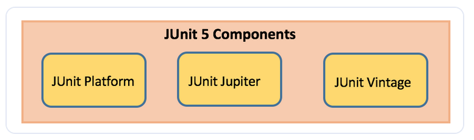
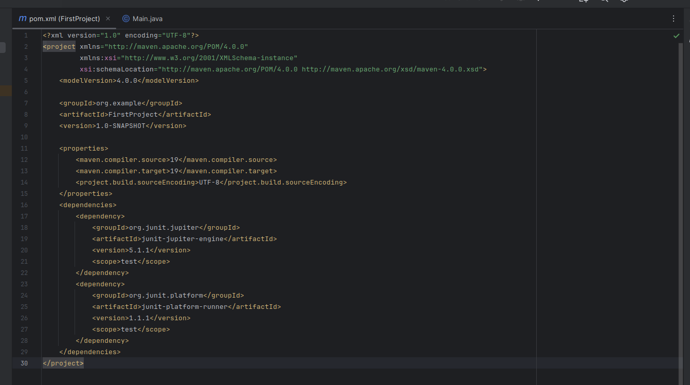
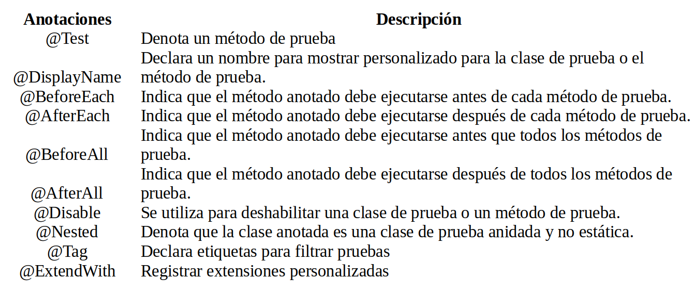
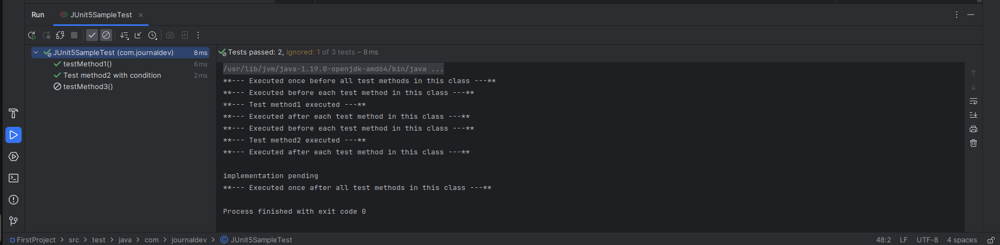
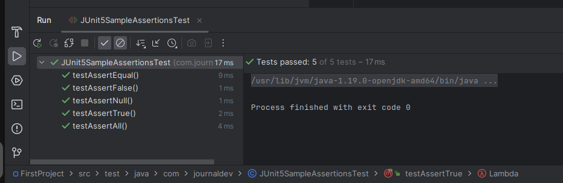
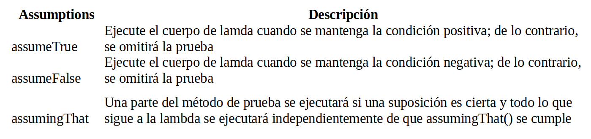
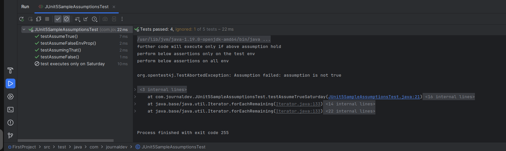

# JUnit5
## Tutorial JUnit5
En este tutorial de Junit, presentaremos los conceptos básicos de JUnit5 y sus nuevas funciones mediante ejemplos. En el mundo Java, JUnit es uno de los marcos populares utilizados para implementar pruebas unitarias en código Java. JUnit ayuda principalmente a los desarrolladores a probar ellos mismos su código en la JVM.

## Arquitectura JUnit5


### JUnit platform
* Lanza marcos de prueba en la JVM
* Se ha utilizado la API TestEngine para crear un marco de pruebas que se ejecuta en la plataforma JUnit

### JUnit Jupiter
* Combinación de un nuevo modelo de programación para pruebas de escritura y un modelo de extensión para extensiones.
* Adición de nuevas anotaciones como @BeforeEach, @AfterEach, @AfterAll, @BeforeAll, etc.

### JUnit Vintage
* Proporciona soporte para ejecutar pruebas anteriores de JUnit versión 3 y 4 en esta nueva plataforma

## Dependencias de JUnit Maven
Para implementar casos de prueba basados en JUnit5 en un proyecto, agregue la siguiente dependencia al archivo pom.xml del proyecto:

``` java
<dependency>
     <groupId>org.junit.jupiter</groupId>
     <artifactId>junit-jupiter-engine</artifactId>
     <version>5.1.1</version>
     <scope>test</scope>
</dependency>
<dependency>
     <groupId>org.junit.platform</groupId>
     <artifactId>junit-platform-runner</artifactId>
     <version> 1.1.1</version>
     <scope>test</scope>
</dependency>
``` 


Proveedor JUnit5 maven surefire para ejecutar las pruebas unitarias donde el IDE no tiene soporte para JUnit5 (si el IDE tiene soporte, entonces este punto no es necesario)

``` java
<plugin>
     <artifactId>maven-surefire-plugin</artifactId>
     <version>2.19.1</version>
     <dependencies>
          <dependency>
               <groupId>org.junit.platform</groupId>
               <artifactId>junit-platform-surefire-provider</artifactId>
               <version>1.0.2</version>
          </dependency>
     </dependencies>
</plugin>
```
En el caso de que uses IntelliJ idea, no es necesario el punto anterior debido a que este IDE tiene soporte para JUnit5

## Nuevas características de JUnit5
Requiere Java 8 o superior en tiempo de ejecución. Pero todavía se puede probar el código compilado utilizando versiones anteriores de Java. Se han introducido varias características nuevas.

### JUnit Annotations
A continuación se enumeran algunas anotaciones de uso común que se proporcionan en él:



``` java
package com.journaldev;

import org.junit.jupiter.api.AfterAll;
import org.junit.jupiter.api.AfterEach;
import org.junit.jupiter.api.BeforeAll;
import org.junit.jupiter.api.BeforeEach;
import org.junit.jupiter.api.Disabled;
import org.junit.jupiter.api.DisplayName;
import org.junit.jupiter.api.Test;
public class JUnit5SampleAnnotationsTest {

    @BeforeAll
    static void beforeAll() {

        System.out.println("**--- Executed once before all test methods in this class ---**");
    }
    @BeforeEach
    void beforeEach() {
        System.out.println("**--- Executed before each test method in this class ---**");
    }

    @Test
    void testMethod1() {
        System.out.println("**--- Test method1 executed ---**");
    }

    @DisplayName("Test method2 with condition")
    @Test
    void testMethod2() {
        System.out.println("**--- Test method2 executed ---**");
    }

    @Test
    @Disabled("implementation pending")
    void testMethod3() {
        System.out.println("**--- Test method3 executed ---**");
    }

    @AfterEach
    void afterEach() {
        System.out.println("**--- Executed after each test method in this class ---**");
    }

    @AfterAll
    static void afterAll() {
        System.out.println("**--- Executed once after all test methods in this class ---**");
    }
}
```

Ejecución de la clase de prueba JUnit5SampleAnnotationsTest

### JUnit Assertions
Cada método de prueba debe evaluarse contra la condición de verdadero mediante aserciones para que la prueba pueda continuar ejecutándose. Las afirmaciones de JUnit Júpiter se mantienen en la clase org.junit.jupiter.api.Assertions. Todos los métodos son estáticos.


``` java
package com.journaldev;

import org.junit.jupiter.api.Assertions;
import org.junit.jupiter.api.Test;
import static org.junit.jupiter.api.Assertions.*;

public class JUnit5SampleAssertionsTest {
    @Test
    void testAssertEqual() {
        assertEquals("ABC", "ABC");
        assertEquals(20, 20, "optional assertion message");
        assertEquals(2 + 2, 4);
    }

    @Test
    void testAssertFalse() {
        assertFalse("FirstName".length() == 10);
        assertFalse(10 > 20, "assertion message");
    }

    @Test
    void testAssertNull() {
        String str1 = null;
        String str2 = "abc";
        assertNull(str1);
        assertNotNull(str2);
    }

    @Test
    void testAssertAll() {
        String str1 = "abc";
        String str2 = "pqr";
        String str3 = "xyz";
        assertAll("numbers",
                () -> assertEquals(str1,"abc"),
                () -> assertEquals(str2,"pqr"),
                () -> assertEquals(str3,"xyz")
        );
        //uncomment below code and understand each assert execution
     /*assertAll("numbers",
		  () -> assertEquals(str1,"abc"),
		  () -> assertEquals(str2,"pqr1"),
		  () -> assertEquals(str3,"xyz1")
	 );*/
    }

    @Test
    void testAssertTrue() {
        assertTrue("FirstName".startsWith("F"));
        Throwable exception = Assertions.assertThrows(IllegalArgumentException.class, () -> {
            throw new IllegalArgumentException("Illegal Argument Exception occurred");
        });
        assertEquals("Illegal Argument Exception occurred", exception.getMessage());
    }
}     
```


Ejecución de la clase de prueba JUnit5SampleAssertionsTest

### JUnit5 Imports
Sus clases de prueba necesitan la declaración de importación org.junit.jupiter.api.Test y no org.junit.Test. Además, no es necesario que los métodos de prueba sean un paquete público y local.
``` java
import org.junit.jupiter.api.Test;
```

### JUnit5 Assumptions
Los assumptions son métodos estáticos en la clase org.junit.jupiter.api.Assumptions. Ejecutarán una prueba solo cuando se cumpla la condición especificada; de lo contrario, la prueba se cancelará. La prueba abortada no provocará un error de compilación. Cuando falla una suposición, se lanza org.opentest4j.TestAbortedException y se omite la prueba.



``` java
package com.journaldev;

import java.time.LocalDateTime;
import org.junit.jupiter.api.Test;
import static org.junit.jupiter.api.Assumptions.*;
import static org.junit.jupiter.api.Assertions.*;
import org.junit.jupiter.api.DisplayName;

public class JUnit5SampleAssumptionsTest {
    @Test
    void testAssumeTrue() {
        boolean b = 'A' == 'A';
        assumeTrue(b);
        assertEquals("Hello", "Hello");
    }

    @Test
    @DisplayName("test executes only on Saturday")
    public void testAssumeTrueSaturday() {
        LocalDateTime dt = LocalDateTime.now();
        assumeTrue(dt.getDayOfWeek().getValue() == 6);
        System.out.println("further code will execute only if above assumption holds true");
    }

    @Test
    void testAssumeFalse() {
        boolean b = 'A' != 'A';
        assumeFalse(b);
        assertEquals("Hello", "Hello");
    }

    @Test
    void testAssumeFalseEnvProp() {
        System.setProperty("env", "prod");
        assumeFalse("dev".equals(System.getProperty("env")));
        System.out.println("further code will execute only if above assumption hold");
    }

    @Test
    void testAssumingThat() {
        System.setProperty("env", "test");
        assumingThat("test".equals(System.getProperty("env")),
                () -> {
                    assertEquals(10, 10);
                    System.out.println("perform below assertions only on the test env");
                });

        assertEquals(20, 20);
        System.out.println("perform below assertions on all env");
    }

}
```

Ejecución de la clase de prueba JUnit5SampleAssumptionsTest

### JUnit Nested Test Classes
Las nested test permiten crear clases anidadas y ejecutar todos sus métodos de prueba. Las clases internas deben ser no estáticas. Simplemente anote las clases internas con @Nested y se ejecutarán todos los métodos de prueba dentro de ellas.


