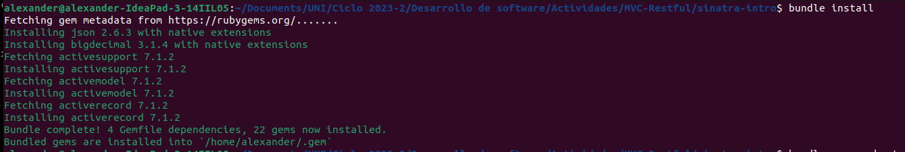
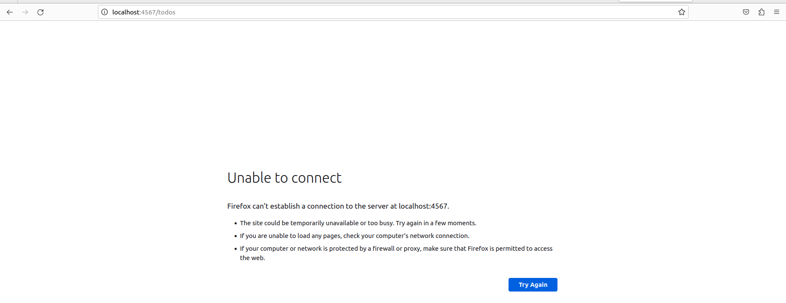
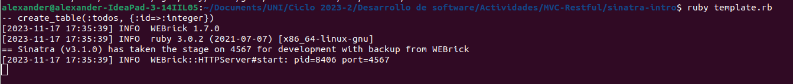
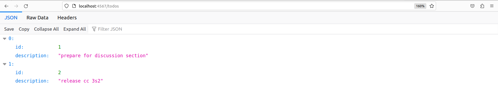
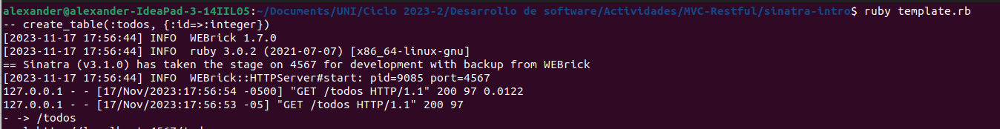
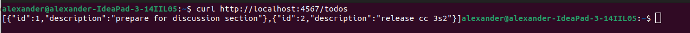

# Demostración de MVC, rutas RESTful y CRUD con Sinatra
## Instrucciones
En esta sección veremos cómo aplicar ideas de MVC, RESTful Routes y CRUD en el contexto de Sinatra para crear una aplicación de lista de tareas pendientes. Cuando hayas terminado, los usuarios deberían poder ir a tu sitio web, ver su lista de tareas pendientes, crear nuevos elementos de la lista, editar elementos de la lista y eliminar elementos de la lista.

Construiremos el código base, con el código de inicio ubicado dado en el repositorio de la actividad. Aquí está la referencia a [Sinatra](https://sinatrarb.com/intro.html) ¡que será útil!.

Presenta esta tarea individual en un repositorio llamado MVC-Restful, CRUD con evidencia del proceso dado. Puedes trabajar en equipo para resolver los ejercicios.

## Configuración
Cambiar de directorio
``` ruby
cd sinatra-intro/
```
Luego, instalamos las gemas especificadas en el archivo Gemfile de nuestro proyecto con el comando:
``` ruby
bundle install
```


Antes de ejecutar el comando: 
``` ruby
ruby template.rb
```
Vamos a ingresar al siguiente enlace en un navegador para ver la página web y verificar si está funcionando.
```
http://localhost:4567/todos
```

Esto nos muestra que antes de ejecutar el comando _ruby template.rb_ la página web no está funcionando.

Ahora ejecutemos el comando 

Podemos observar que se ha ejecutado una migración para crear una tabla llamada "todos" en la base de datos. La tabla tiene una columna llamada "id" con tipo de dato "integer". Además, muestra que la aplicación Sinatra se ha iniciado con éxito en el puerto 4567, y está lista para manejar las solicitudes web entrantes.

Ahora ingresamos el enlace en un navegador para ver la página web y verificar si está funcionando.


La aplicación está respondiendo con una lista de tareas almacenadas en la base de datos cuando se accede a la ruta /todos. Cada tarea en la lista tiene un identificador único (id) y una descripción (description).

Nos dirigimos a la terminal para ver las nuevas solicitudes realizadas. 

Se observa que se realizó una solicitud GET a la ruta /todos en la aplicación Sinatra y la solicitud se procesó con éxito.

Además, prueba el siguiente comando usando 'curl' para verificar que la aplicación se esté ejecutando localmente y responda. El comando activa una solicitud GET para recuperar la lista de "cosas por hacer" y debería recibir una respuesta que se muestra en la salida estándar de la línea de comando. Abrimos otra terminal y colocamos el comando:
```
curl http://localhost:4567/todos
```

