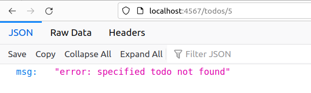
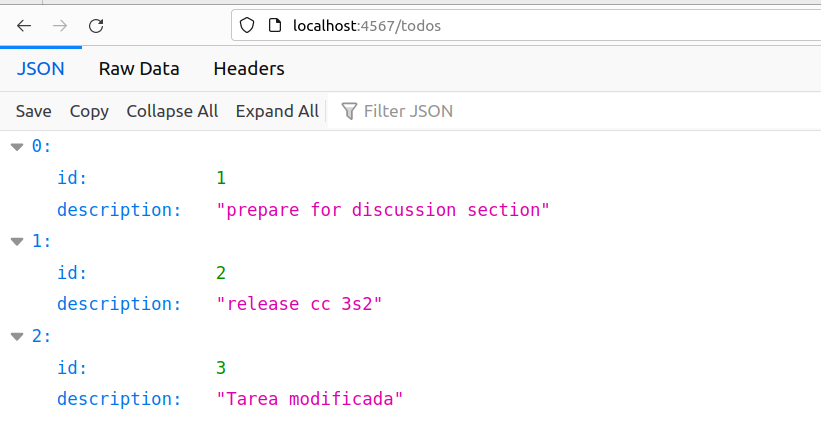

# Demostración de MVC, rutas RESTful y CRUD con Sinatra
## Instrucciones
En esta sección veremos cómo aplicar ideas de MVC, RESTful Routes y CRUD en el contexto de Sinatra para crear una aplicación de lista de tareas pendientes. Cuando hayas terminado, los usuarios deberían poder ir a tu sitio web, ver su lista de tareas pendientes, crear nuevos elementos de la lista, editar elementos de la lista y eliminar elementos de la lista.

Construiremos el código base, con el código de inicio ubicado dado en el repositorio de la actividad. Aquí está la referencia a [Sinatra](https://sinatrarb.com/intro.html) ¡que será útil!.

Presenta esta tarea individual en un repositorio llamado MVC-Restful, CRUD con evidencia del proceso dado. Puedes trabajar en equipo para resolver los ejercicios.

## Configuración
Cambiar de directorio
``` ruby
cd sinatra-intro/
```
Luego, instalamos las gemas especificadas en el archivo Gemfile de nuestro proyecto con el comando:
``` ruby
bundle install
```


Antes de ejecutar el comando: 
``` ruby
ruby template.rb
```
Vamos a ingresar al siguiente enlace en un navegador para ver la página web y verificar si está funcionando.
```
http://localhost:4567/todos
```

Esto nos muestra que antes de ejecutar el comando _ruby template.rb_ la página web no está funcionando.

Ahora ejecutemos el comando 

Podemos observar que se ha ejecutado una migración para crear una tabla llamada "todos" en la base de datos. La tabla tiene una columna llamada "id" con tipo de dato "integer". Además, muestra que la aplicación Sinatra se ha iniciado con éxito en el puerto 4567, y está lista para manejar las solicitudes web entrantes.

Ahora ingresamos el enlace en un navegador para ver la página web y verificar si está funcionando.


La aplicación está respondiendo con una lista de tareas almacenadas en la base de datos cuando se accede a la ruta /todos. Cada tarea en la lista tiene un identificador único (id) y una descripción (description).

Nos dirigimos a la terminal para ver las nuevas solicitudes realizadas. 

Se observa que se realizó una solicitud GET a la ruta /todos en la aplicación Sinatra y la solicitud se procesó con éxito.

Además, prueba el siguiente comando usando 'curl' para verificar que la aplicación se esté ejecutando localmente y responda. El comando activa una solicitud GET para recuperar la lista de "cosas por hacer" y debería recibir una respuesta que se muestra en la salida estándar de la línea de comando. Abrimos otra terminal y colocamos el comando:
```
curl http://localhost:4567/todos
```

Se obtiene una salida en formato JSON ya que la ruta /todos de la aplicación Sinatra está configurada para responder en formato JSON cuando se hace una solicitud GET a esa ruta. 

En los siguientes ejercicios, agregaremos más rutas y podrás continuar usando comandos curl con diferentes argumentos para verificar la corrección de sus comportamientos.

Objetivo: Tu tarea es implementar las partes del archivo denominado TU CODIGO AQUI. La referencia que contiene las soluciones se encuentra en el archivo ```final.rb```

## Parte 1
Lo primero que vamos a hacer es crear un modelo. A diferencia de Rails, Sinatra no tiene MVC integrado, así que vamos a piratear el nuestro. Usaremos ActiveRecord sobre una base de datos SQLite. En esta aplicación, ¿cuál será nuestro modelo y qué operaciones CRUD le aplicaremos?
* index: Esta operación mostrará una lista de todas las tareas por hacer existentes en la base de datos, se utiliza la ruta '/todos' para acceder a esta operación.
``` ruby
get '/todos' do
	content_type :json
	Todo.all.to_json
end
```
El codigo nos muestra que cuando alguien acceda a la ruta '/todos', este bloque de código se ejecuta y devuelve una respuesta que contiene todas las tareas por hacer almacenadas en la base de datos en formato JSON.

* create: Esta operación permitirá agregar nuevas tareas por hacer a la base de datos.
``` ruby
post '/todos' do
  content_type :json
  request_body = JSON.parse(request.body.read)
  description = request_body['description']

  if description && !description.empty?
    new_todo = Todo.create(description: description)
    { msg: "create success", todo_id: new_todo.id }.to_json
  else
    { msg: "error: description can't be blank" }.to_json
  end
end
```
Este codigo, nos muestra que cuando alguien envía una solicitud POST a la ruta '/todos' con una descripción válida, este bloque de código crea una nueva tarea por hacer en la base de datos y devuelve un mensaje de éxito junto con el id de la nueva tarea en formato JSON. Ahora bien, si la descripción está vacía o no se proporciona, se devuelve un mensaje de error en formato JSON.
Mandemos una solicitud POST usando curl:

Luego observemos la respuesta en la consola donde se está ejecutando nuestro programa


El estado 200 indica que la solicitud fue exitosa.


* read: Esta operación mostrará los detalles de una tarea específica, identificada por su ID.
``` ruby
get '/todos/:id' do
  content_type :json
  todo = Todo.find_by_id(params[:id])
  if todo
    return {description: todo.description}.to_json
  else
    return {msg: "error: specified todo not found"}.to_json
  end
end
```
Este código nos muestra que cuando alguien envía una solicitud GET a la ruta '/todos/:id' con un ID válido, este bloque de código busca la tarea correspondiente en la base de datos y devuelve los detalles de esa tarea en formato JSON. Si no se encuentra la tarea, se devuelve un mensaje de error en formato JSON.




* update: Esta operación permitirá modificar una tarea existente.
``` ruby
put '/todos/:id' do
  content_type :json
  todo = Todo.find_by_id(params[:id])

  if todo
    request_body = JSON.parse(request.body.read)
    new_description = request_body['description']

    if new_description && !new_description.empty?
      todo.update(description: new_description)
      { msg: "update success" }.to_json
    else
      { msg: "error: description can't be blank" }.to_json
    end
  else
    { msg: "error: specified todo not found" }.to_json
  end
end
```

El código permite actualizar la descripción de una tarea existente en la base de datos utilizando una solicitud HTTP PUT con un parámetro de ruta :id para identificar la tarea que se va a actualizar. Toma la nueva descripción de la tarea del cuerpo de la solicitud HTTP (request body) en formato JSON. Luego, actualiza la descripción de la tarea en la base de datos con la nueva descripción proporcionada. Devuelve una respuesta JSON que indica "update success" si la actualización fue exitosa. En caso de que la tarea no existe o la nueva descripción está en blanco, se devuelve un mensaje de error en JSON.



* destroy: Esta operación eliminará una tarea existente de la base de datos.
``` ruby
delete '/todos/:id' do
  content_type :json
  todo = Todo.find_by_id(params[:id])

  if todo
    todo.destroy
    { msg: "delete success" }.to_json
  else
    { msg: "error: specified todo not found" }.to_json
  end
end
```
Este código sirve para eliminar una tarea específica de la lista de tareas. Utiliza el metodo DELETE que incluye el parámetro de ruta :id (delete '/todos/:id') para identificar la tarea que se va a eliminar. Si la tarea con el ID proporcionado existe en la base de datos, se elimina. Si no existe, se devuelve un mensaje de error.


## Parte 2


