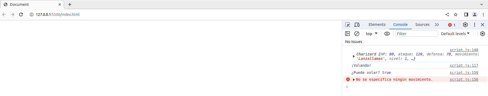

# Practica calificada 4
## Pregunta 2
Practiquemos la herencia y la programación orientada a objetos en Javascript. Diseña 2 clases, una llamada "Pokemon" y otra llamada "Charizard". Las clases deben hacer lo siguiente:
- Clase Pokémon:
* El constructor toma 3 parámetros (HP, ataque, defensa)
* El constructor debe crear 6 campos (HP, ataque, defensa, movimiento, nivel, tipo). Los valores de (mover, nivelar, tipo) debe inicializarse en ("", 1, "").
* Implementa un método flight que arroje un error que indique que no se especifica ningún movimiento.
* Implementa un método canFly que verifica si se especifica un tipo. Si no, arroja un error. Si es así, verifica si el tipo incluye ‘’flying’. En caso afirmativo, devuelve verdadero; si no, devuelve falso.
  
- Clase Charizard:
* El constructor toma 4 parámetros (HP, ataque, defensa, movimiento)
* El constructor configura el movimiento y el tipo (para "disparar/volar") además de establecer HP, ataque y defensa como el constructor de superclase.
* Sobreescribe el método fight . Si se especifica un movimiento, imprime una declaración que indique que se está utilizando el movimiento y devuelve el campo de ataque. Si no arroja un error.  (implementa utilizando JavaScript )  (1 punto).

``` javascript
class Pokemon {
 constructor(HP, ataque, defensa) {
   this.HP = HP;
   this.ataque = ataque;
   this.defensa = defensa;
   this.movimiento = "";
   this.nivel = 1;
   this.tipo = "";
 }

 flight() {
   if (!this.movimiento) {
     throw new Error("No se especifica ningún movimiento.");
   }
   console.log("¡Volando!");
 }

 canFly() {
   if (!this.tipo) {
     throw new Error("No se especifica ningún tipo.");
   }
   return this.tipo.includes("volar");
 }
}

// Clase Charizard (hereda de Pokémon)
class Charizard extends Pokemon {
 constructor(HP, ataque, defensa, movimiento) {
   super(HP, ataque, defensa);
   this.movimiento = movimiento;
   this.tipo = "fuego/volar";
 }

 fight() {
   if (this.movimiento) {
     console.log(`Utilizando el movimiento: ${this.movimiento}`);
     return this.ataque;
   } else {
     throw new Error("No se especifica ningún movimiento.");
   }
 }
}

const charizardInstance = new Charizard(80, 120, 70, "Lanzallamas");
console.log(charizardInstance);
charizardInstance.flight();
console.log("¿Puede volar?", charizardInstance.canFly());

try {
 const charizardWithoutMove = new Charizard(80, 120, 70);
 charizardWithoutMove.fight(); // Esto debería arrojar un error
} catch (error) {
 console.error(error.message);
}
```

El resultado es el siguiente

