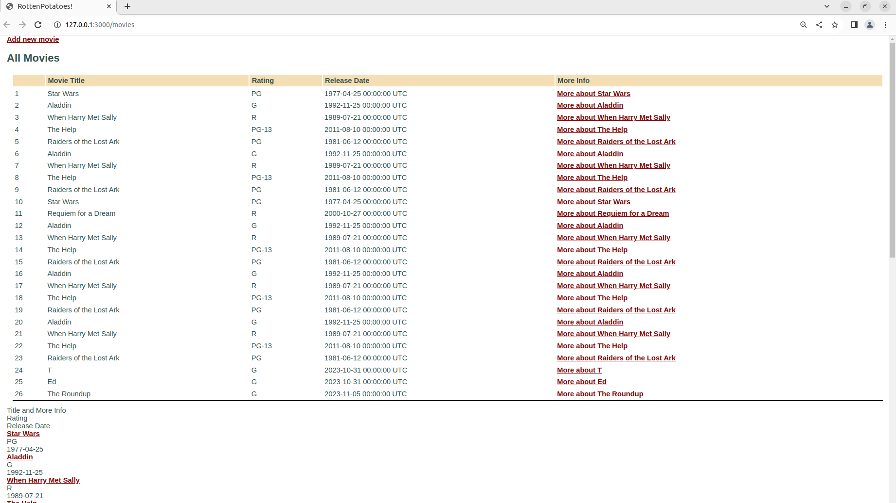

# Practica calificada 4
## Pregunta 1
``` ruby
def grep_simplificado(cad_buscar, array_indicadores, files_to_search)
  # -n  nombre_archivo: numero de coincidencia
  if array_indicadores[0]
    files_to_search.each do |nombre_del_archivo|
      numero_de_coincidencia = 0
      File.open(nombre_del_archivo, 'r') do |archivo|
        archivo.each_line do |linea|
          # CODIGO PARA ENCONTRAR LAS COINCIDENCIAS
        end
      end
      puts nombre_del_archivo + " : "
      puts numero_de_coincidencia
    end
  end

  # -l  nombre de archivos que contiene al menos una linea de coincidencia
  if array_indicadores[1]
    files_to_search.each do |nombre_del_archivo|
      numero_de_coincidencia = 0
      File.open(nombre_del_archivo, 'r') do |archivo|
        archivo.each_line do |linea|
          # CODIGO PARA ENCONTRAR LAS COINCIDENCIAS
        end
      end
      if numero_de_coincidencia > 0
        puts nombre_del_archivo
      end
    end
  end

  # -i  numero de coincidencia (sin importar si es mayuscula o minuscula)
  if array_indicadores[2]
    files_to_search.each do |nombre_del_archivo|
      numero_de_coincidencia = 0
      File.open(nombre_del_archivo, 'r') do |archivo|
        archivo.each_line do |linea|
          # CODIGO PARA ENCONTRAR LAS COINCIDENCIAS (sin importar si es mayuscula o minuscula)
        end
      end
      puts numero_de_coincidencia
    end
  end

  # -v  numero de lineas que no coinciden
  if array_indicadores[3]
    files_to_search.each do |nombre_del_archivo|
      numero_de_coincidencia = 0
      numero_de_lineas = 0
      File.open(nombre_del_archivo, 'r') do |archivo|
        archivo.each_line do |linea|
          numero_de_lineas = numero_de_lineas + 1
          # CODIGO PARA ENCONTRAR LAS COINCIDENCIAS
        end
      end
      puts numero_de_lineas - numero_de_coincidencia
    end
  end

  # -x  Busca solo líneas donde la cadena de búsqueda coincida con la línea completa
  if array_indicadores[4]
    files_to_search.each do |nombre_del_archivo|
      numero_de_coincidencia = 0
      File.open(nombre_del_archivo, 'r') do |archivo|
        archivo.each_line do |linea|
          if linea == cad_buscar
            numero_de_coincidencia = numero_de_coincidencia + 1
          end
        end
      end
      puts numero_de_coincidencia
    end
  end
end

V_indicadores = [true, false, false, false, false]
cadena = "ciclo 2023-2"
V_archivos = ['cursos.txt', 'deportes.txt']
grep_simplificado(cadena, V_indicadores, V_archivos)

# INDICADORES
# -n  nombre_archivo: numero de coincidencia
# -l  nombre de archivos que contiene al menos una linea de coincidencia
# -i  numero de coincidencia (sin importar si es mayuscula o minuscula)
# -v  numero de lineas que no coinciden
# -x  Busca solo líneas donde la cadena de búsqueda coincida con la línea completa
```

El código contiene un método llamado grep_simplificado el cual tiene 3 parámetros, el 1er parámetro es una cadena a buscar, el 2do es un arreglo de valores booleanos (por ejemplo, array_indicadores[3] si es verdadero significa que se tomará en cuenta el indicador -v, caso contrario no se tomará en cuenta) y el 3ero es un arreglo de strings con los nombres de los archivos donde se hará las búsqueda.
El código muestra en pantalla respuestas acorde a lo especificado en cada indicador

- El código no ha sido terminado, aún me falta desarrollar el código para el cálculo del número de coincidencias
- Se subió los archivos .txt al repositorio y el código

## Pregunta 2
Practiquemos la herencia y la programación orientada a objetos en Javascript. Diseña 2 clases, una llamada "Pokemon" y otra llamada "Charizard". Las clases deben hacer lo siguiente:
- Clase Pokémon:
* El constructor toma 3 parámetros (HP, ataque, defensa)
* El constructor debe crear 6 campos (HP, ataque, defensa, movimiento, nivel, tipo). Los valores de (mover, nivelar, tipo) debe inicializarse en ("", 1, "").
* Implementa un método flight que arroje un error que indique que no se especifica ningún movimiento.
* Implementa un método canFly que verifica si se especifica un tipo. Si no, arroja un error. Si es así, verifica si el tipo incluye ‘’flying’. En caso afirmativo, devuelve verdadero; si no, devuelve falso.
  
- Clase Charizard:
* El constructor toma 4 parámetros (HP, ataque, defensa, movimiento)
* El constructor configura el movimiento y el tipo (para "disparar/volar") además de establecer HP, ataque y defensa como el constructor de superclase.
* Sobreescribe el método fight . Si se especifica un movimiento, imprime una declaración que indique que se está utilizando el movimiento y devuelve el campo de ataque. Si no arroja un error.  (implementa utilizando JavaScript )  (1 punto).

``` javascript
class Pokemon {
 constructor(HP, ataque, defensa) {
   this.HP = HP;
   this.ataque = ataque;
   this.defensa = defensa;
   this.movimiento = "";
   this.nivel = 1;
   this.tipo = "";
 }

 flight() {
   if (!this.movimiento) {
     throw new Error("No se especifica ningún movimiento.");
   }
   console.log("¡Volando!");
 }

 canFly() {
   if (!this.tipo) {
     throw new Error("No se especifica ningún tipo.");
   }
   return this.tipo.includes("volar");
 }
}

// Clase Charizard (hereda de Pokémon)
class Charizard extends Pokemon {
 constructor(HP, ataque, defensa, movimiento) {
   super(HP, ataque, defensa);
   this.movimiento = movimiento;
   this.tipo = "fuego/volar";
 }

 fight() {
   if (this.movimiento) {
     console.log(`Utilizando el movimiento: ${this.movimiento}`);
     return this.ataque;
   } else {
     throw new Error("No se especifica ningún movimiento.");
   }
 }
}

const charizardInstance = new Charizard(80, 120, 70, "Lanzallamas");
console.log(charizardInstance);
charizardInstance.flight();
console.log("¿Puede volar?", charizardInstance.canFly());

try {
 const charizardWithoutMove = new Charizard(80, 120, 70);
 charizardWithoutMove.fight(); // Esto debería arrojar un error
} catch (error) {
 console.error(error.message);
}
```

El resultado es el siguiente


## Pregunta
Modifique la lista de películas de la siguiente manera. Cada modificación va a necesitar que realice un cambio en una capa de abstracción diferente.
a) Modifica la vista Index para incluir el número de fila de cada fila en la tabla de películas.
Para ello vamos a modificar el archivo ```'app/views/movies/index.html.erb'```


``` ruby
<%= link_to 'Add new movie', new_movie_path %>

<h2>All Movies</h2>

<table id="movies">
  <thead>
    <tr>
      <th></th>         # Agremos esta linea para tener una columna vacia al lado izquierdo
      <th>Movie Title</th>
      <th>Rating</th>
      <th>Release Date</th>
      <th>More Info</th>
    </tr>
  </thead>

  <tbody>
    <% @movies.each do |movie| %>
      <tr>
        <td><%= movie.id %></td>      # Agregamos esta linea para visualizar el número de fila de cada fila en la tabla de películas
        <td><%= movie.title %></td>
        <td><%= movie.rating %></td>
        <td><%= movie.release_date %></td>
        <td><%= link_to "More about #{movie.title}", movie_path(movie) %></td>
      </tr>
    <% end %>
  </tbody>
</table>

<div class="row bg-dark text-white">
  <div class="col-6 text-center">Title and More Info</div>
  <div class="col-2 text-center">Rating</div>
  <div class="col-4 text-center">Release Date</div>
</div>

<%= render partial: 'movie', collection: @movies %>
```

Ejecutamos el servidor y obtenemos lo siguiente: 

