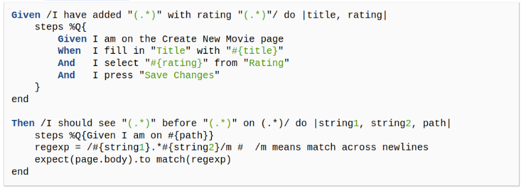

# PracticaCalificada5
## Preguntas:  En este conjunto de preguntas tus respuestas deben ir de acuerdo a las actividades correspondientes, no se puntúa sino hay evidencia del uso de los scripts desarrollados y solo presentas respuestas sin evidencia de lo desarrollado a lo largo del curso. (7 puntos)
### 1

### 2
### 3
### 4 De la actividad relacionada a BDD e historias de usuario crea definiciones de pasos que te permitan escribir los siguientes pasos en un escenario de RottenPotatoes:
```
Given the movie "Inception" exists
	And it has 5 reviews
	And its average review score is 3.5
Escenario: buscar la pelicula "Inception" por su ID
  Dado que la pelicula "Inception" existe
  Cuando escribimos el ID de la pelicula en una etiqueta de texto relacionada con "buscar"
  Y damos click en "buscar"
  Entonces el programa me muestra todos los detalles sobre la pelicula "Inception"

Escenario: mostrar reseñas de la pelicula "Inception" al buscarlo por su ID
  Dado 5 reseñas existentes de "Inception"
  Cuando escrimos el ID de la pelicula "Inception" en una etiqueta de texto relacionada con "review"
  Y damos click en "review"
  Entonces el programa me muestra todas las reseñas existente de la pelicula "Inception"

Escenario: mostrar puntuación media de reseñas de la pelicula "Inception" al buscarlo por su ID
  Dado 5 reseñas existentes de "Inception"
  Cuando escrimos el ID de la pelicula "Inception" en una etiqueta de texto relacionada con "review score"
  Y damos click en "review score"
  Entonces el programa me muestra la puntuación media de review de la pelicula "Inception"
  Y es igual a 3.5
```

### 5
### 6 De la actividad relacionadas a BDD e historias de usuario indica una lista de pasos como los de la siguiente figura



Para implementar el siguiente paso: ```When / I delete the movie: "(.*)"/ do |title| ```

```
When / I delete the movie: "(.*)"/ do |title|
  steps %Q{
    Given I am on Delete page
    When I found in "Title" with "#{title}"
    And I press "delete"
  }
end
```

### 7 Basándose en el siguiente fichero de especificaciones (specfile), ¿a qué métodos deberían responder las instancias de F1 para pasar las pruebas?

``` ruby
require 'f1'
describe F1 do
	describe "a new f1" do
		before :each do ; @f1 = F1.new ; end
		it "should be a pain in the butt" do
			@f1.should be_a_pain_in_the_butt
		end
                it "should be awesome" do
                  	@f1.should be_awesome
              	end
               	it "should not be nil" do
                 	@f1.should_not  be_nil
            	end
           	it "should not be the empty string" do
               		@f1.should_not == ""
            	end
	end
end
```
Para que pasen las pruebas, las instancias deben responder a los metodos ```be_a_pain_in_the_butt```, ```be_awesome```, ```be_nil``` y ```empty```. Estos metodos deben ser implementados necesariamente en la clase F1 que debe estar ubicada en la carpeta llamada ```lib```.
Si no existe tal implementacion, debe escribirse el codigo necesario para que pasen las pruebas.


## Pregunta:   Utilizando historias de usuario y Cucumber (8 puntos)
### 1
### 2
### 3
### 4
### 5
### 6
### 7

## Pregunta (5 puntos) : Para el siguiente ejercicio utiliza la lista de proyectos Rails de código abierto en Open Source Rails: (link)[https://github.com/gramantin/awesome-rails#open-source-rails-apps]
### 1
### 2
### 3

