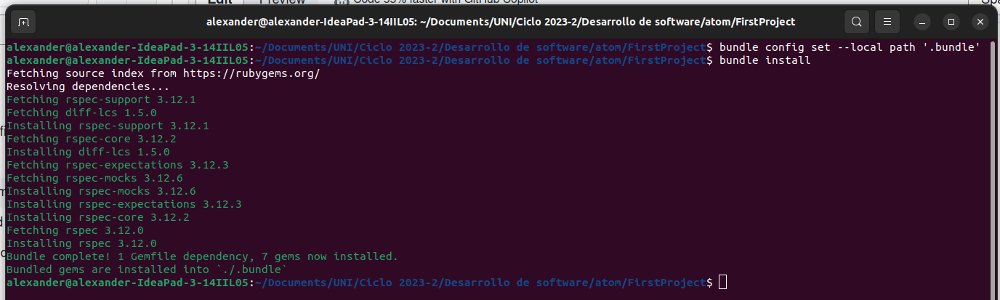
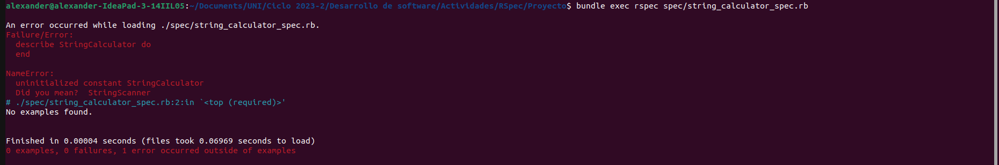
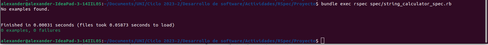

# Primeros pasos con RSpec
RSpec es una herramienta de prueba para Ruby, creada para el desarrollo impulsado por el comportamiento (BDD). Es la biblioteca de prueba más utilizada para Ruby en aplicaciones de producción. Aunque tiene un DSL (lenguaje específico de dominio) muy rico y potente, en esencia es una herramienta sencilla que puedes empezar a utilizar con bastante rapidez. Este tutorial de RSpec lo ayudará a comenzar, suponiendo que no tenga experiencia previa con la biblioteca e incluso con pruebas.

## La idea detrás del BDD
Para comprender por qué RSpec es como es, debemos comprender el objetivo de BDD y su padre, TDD.

La idea del desarrollo basado en pruebas (test-driven development) fue presentada por primera vez a una audiencia más amplia por Kent Beck en su libro de 2000 Extreme Programming Explained. En lugar de escribir siempre pruebas para algún código que ya tenemos, trabajamos en un bucle rojo-verde:
* Escriba el caso de prueba más pequeño posible que coincida con lo que necesitamos programar.
* Ejecute la prueba y observe cómo falla. Esto te hace pensar en cómo escribir sólo el código que lo hace pasar.
* Escriba algún código para que la prueba pase.
* Ejecute su conjunto de pruebas. Repita los pasos 3 y 4 hasta que pasen todas las pruebas.
* Regrese y refactorice su nuevo código, haciéndolo lo más simple y claro posible mientras mantiene el conjunto de pruebas verde.

Este flujo de trabajo implica un “paso cero”: tomarse el tiempo para pensar detenidamente qué es exactamente lo que necesitamos construir y cómo. Cuando siempre comenzamos con la implementación, es fácil perder el foco, escribir código innecesario y quedarnos atascados.

El desarrollo impulsado por el comportamiento (Behavior-driven development) es una idea construida sobre TDD. La idea es escribir pruebas como especificaciones del comportamiento del sistema. Se trata de una forma diferente de abordar un mismo desafío, que nos lleva a pensar con mayor claridad y escribir pruebas más fáciles de entender y mantener. Esto a su vez nos ayuda a escribir un mejor código de implementación.

Un problema común que enfrentan los recién llegados cuando comienzan con las pruebas es caer en la trampa de escribir pruebas que hacen demasiado, prueban muy poco y requieren una concentración profunda para comprender lo que está sucediendo.

``` ruby
def test_making_order
  book = Book.new(:title => "RSpec Intro", :price => 20)
  customer = Customer.new
  order = Order.new(customer, book)

  order.submit

  assert(customer.orders.last == order)
  assert(customer.ordered_books.last == book)
  assert(order.complete?)
  assert(!order.shipped?)
end
```
El ejemplo anterior está escrito con test-unit, un marco de pruebas unitarias que forma parte de la biblioteca estándar de Ruby.
Con RSpec, podemos ser un poco más detallados y describir el comportamiento en aras de la claridad:
``` ruby
describe Order do
  describe "#submit" do

    before do
      @book = Book.new(:title => "RSpec Intro", :price => 20)
      @customer = Customer.new
      @order = Order.new(@customer, @book)

      @order.submit
    end

   describe "customer" do
     it "puts the ordered book in customer's order history" do
       expect(@customer.orders).to include(@order)
       expect(@customer.ordered_books).to include(@book)
     end
   end

   describe "order" do
     it "is marked as complete" do
       expect(@order).to be_complete
     end

     it "is not yet shipped" do
       expect(@order).not_to be_shipped
     end
   end
  end
end
```
Vale la pena señalar que para un ciclo BDD completo necesitaríamos una herramienta como Cucumber para escribir un escenario de afuera hacia adentro en lenguaje humano. Esto también actúa como una prueba de integración de muy alto nivel, asegurando que la aplicación funcione como se espera desde la perspectiva del usuario.

Ahora que hemos cubierto la idea detrás de BDD, es hora de continuar nuestra búsqueda para aprender los conceptos básicos de RSpec.

## Conceptos básicos de RSpec
Este tutorial de RSpec se basará en la implementación de una parte de una calculadora de cadenas. El plan es:
* Cree una calculadora de cadenas simple con un método int Add (string numbers)
* El método puede tomar 0, 1 o 2 números y devolverá su suma. Para una cadena vacía devolverá 0. Por ejemplo, la entrada puede ser "" o "1" o "1,2".
* Permita que el método Add maneje una cantidad desconocida de números.

## Configurando RSpec
Comencemos un nuevo proyecto Ruby donde configuraremos RSpec como una dependencia a través de Bundler.

Cree un nuevo directorio y coloque el siguiente código en su Gemfile:
``` ruby
# Gemfile
source "https://rubygems.org"

gem "rspec"
```
- Gemfile: Es un archivo de configuración utilizado en proyectos de Ruby para especificar las gemas (bibliotecas o paquetes de código) que el proyecto necesita, así como las versiones específicas o restricciones de versiones que deben cumplirse.

Abra el directorio de su proyecto en su terminal y escriba **bundle install --path .bundle** para instalar la última versión de RSpec y todas las dependencias relacionadas. Verá un resultado similar al siguiente:
``` ruby
$ bundle install --path .bundle
Fetching gem metadata from https://rubygems.org/...........
Resolving dependencies...
Using bundler 2.1.4
Fetching diff-lcs 1.3
Installing diff-lcs 1.3
Fetching rspec-support 3.9.2
Installing rspec-support 3.9.2
Fetching rspec-core 3.9.1
Installing rspec-core 3.9.1
Fetching rspec-expectations 3.9.0
Installing rspec-expectations 3.9.0
Fetching rspec-mocks 3.9.1
Installing rspec-mocks 3.9.1
Fetching rspec 3.9.0
Installing rspec 3.9.0
Bundle complete! 1 Gemfile dependency, 7 gems now installed.
Bundled gems are installed into `./.bundle`
```


## Escribiendo el primer spec
Por convención, las pruebas escritas con RSpec se denominan "spec" (abreviatura de "specifications") y se almacenan en el directorio de spec del proyecto. Crea ese directorio en tu proyecto también:

``` ruby
mkdir spec
```
Comencemos a escribir nuestra primera spec. Así es, comenzaremos escribiendo una spec de la calculadora de cadenas, ¡y no de la calculadora de cadenas en sí!

``` ruby
# spec/string_calculator_spec.rb
describe StringCalculator do
end
```
Con RSpec, siempre estamos describiendo el comportamiento de clases, módulos y sus métodos. El bloque de descripción siempre se usa en la parte superior para poner las especificaciones en un contexto. Puede aceptar un nombre de clase, en cuyo caso la clase debe existir, o cualquier cadena que desee.
Dado que los métodos de Ruby no requieren el uso de paréntesis, este archivo ya comienza a parecerse más a un ensayo que a un código de computadora. Ese es exactamente el objetivo.
Para ejecutar las specs, escriba:

``` ruby
$ bundle exec rspec
```
Haga esto ahora y su especificación fallará con el error StringCalculator constante no inicializado. Eso es de esperarse, ya que aún no hemos creado esa clase.



Cree un nuevo directorio llamado lib:

``` ruby
mkdir lib
```

Declare StringCalculator en string_calculator.rb:

``` ruby
# lib/string_calculator.rb
class StringCalculator
end
```

Y solicítelo en su especificación:

``` ruby
# spec/string_calculator_spec.rb
require "string_calculator"

describe StringCalculator do
end
```

La ejecución de RSpec ahora pasa:

``` ruby
$ bundle exec rspec
No examples found.

Finished in 0.00068 seconds (files took 0.30099 seconds to load)
0 examples, 0 failures
```



Lo que hemos logrado aquí es que hemos establecido una configuración de trabajo de nuestro proyecto. Contamos con un circuito de retroalimentación funcional que incluye pruebas y código de aplicación.

Entonces procedamos escribiendo algo de código.

Lo más sencillo que puede hacer nuestra calculadora de cadenas es aceptar una cadena vacía, en cuyo caso podríamos decidir que queremos que devuelva un cero. El método que debemos describir primero es add.

``` ruby
# spec/string_calculator_spec.rb
describe StringCalculator do

  describe ".add" do
    context "given an empty string" do
      it "returns zero" do
        expect(StringCalculator.add("")).to eq(0)
      end
    end
  end
end
``` 


