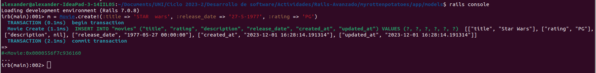
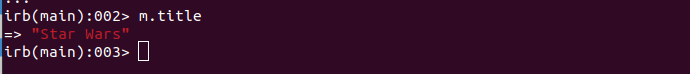
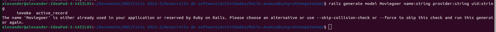
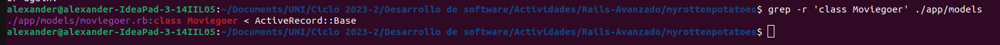
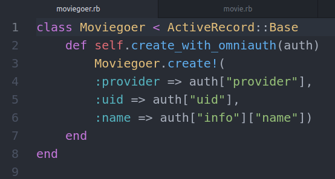

# Rails-Avanzado
Creamos un directorio llamado _Rails-Avanzado_, luego clonamos el repositorio de la [actividad](https://github.com/kapumota/Desarrollo-software-2023/tree/main/Semana7/myrottenpotatoes), nos interesa la carpeta llamada ```myrottenpotatoes```. Esta carpeta contiene varias carpetas y archivos, entre los cuales el archivo Gemfile. Nos dirigimos al directorio ```'Rails-Avanzado/myrottenpotatoes'``` desde la terminal y ejecutamos el comando ```bundle install```, luego para iniciar nuestro servidor web local que escucha en un puerto específico (por defecto, el puerto 3000) ejecutamos el siguiente comando ```bin/rails server```, podemos acceder a nuestra aplicación a través de un navegador web visitando [http://localhost:3000](http://localhost:3000).


Error mostrado desde navegador


Error mostrado desde la terminal


El error mostrado es ```ActiveRecord::StatementInvalid in MoviesController#index```, además nos especifica donde posiblemente se encuentra el error (```app/controllers/application_controller.rb:11:in `set_current_user'```). Al dirigirnos al archivo ```'app/controllers/movies_controller.rb'``` observamos que el método index de la clase MoviesController tiene la siguiente línea ```@movies = Movie.all```, para corregir este error, vamos a cambiar Moviegoer por Movie en el método ```set_current_user``` en el archivo ```application_controller.rb```


Visualizamos que el error ha cambiado, ahora es un error de sintaxis. Este problema se encuentra en el archivo ```app/models/movie.rb```


Quitamos los comentarios y ejecutamos nuevamente el servidor.


El error ha sido corregido. Ahora visualizamos las películas y otros datos. También podemos agregar nuevas películas.

## Vistas parciales, validaciones y filtros
### Vistas parciales
Una vista parcial es el nombre de Rails para una parte reutilizable de una vista. Cuando debe aparecer contenido similar en diferentes vistas, colocar ese contenido en una parte e “incluirlo” en archivos separados ayuda a DRY la repetición.

Creamos el archivo _movie.html.erb en el directorio app/views/movies e incluimos el siguiente fragmento de codigo (actuará como una vista parcial).

``` ruby
<div class="row">
    <div class="col-8"> <%= link_to movie.title, movie_path(movie) %> </div>
    <div class="col-2"> <%= movie.rating %> </div>
    <div class="col-2"> <%= movie.release_date.strftime('%F') %> </div>
</div>
```
Luego cambiaremos el formato de html.haml a html.erb del archivo ```index.html.haml``` y agregamos el siguiente fragmento de codigo en el archivo ```index.html.erb```

``` ruby
<!--  ...other code from index.html.erb here... -->
<div class="row bg-dark text-white">
    <div class="col-6 text-center">Title and More Info</div>
    <div class="col-2 text-center">Rating</div>
    <div class="col-4 text-center">Release Date</div>
</div>
<%= render partial: 'movie', collection: @movies %>
```

**IMPORTANTE:** para agregar la vista parcial del archivo llamado ```_movie.html.erb``` en ```<%= render partial: 'movie', collection: @movies %>``` se escribe el nombre sin guión bajo ni la extension .html.erb (movie).

Ejecutamos nuevamente el servidor y se sigue observando las tablas y no arroja ningún error


### Validaciones
Las validaciones de modelos, al igual que las migraciones, se expresan en un mini-DSL integrado en Ruby, como muestra en el siguiente código. Escribe el código siguiente en el código dado en ```app/models/movie.rb```

``` ruby
class Movie < ActiveRecord::Base
    def self.all_ratings ; %w[G PG PG-13 R NC-17] ; end #  shortcut: array of strings
    validates :title, :presence => true
    validates :release_date, :presence => true
    validate :released_1930_or_later # uses custom validator below
    validates :rating, :inclusion => {:in => Movie.all_ratings},
        :unless => :grandfathered?
    def released_1930_or_later
        errors.add(:release_date, 'must be 1930 or later') if
        release_date && release_date < Date.parse('1 Jan 1930')
    end
    @@grandfathered_date = Date.parse('1 Nov 1968')
    def grandfathered?
        release_date && release_date < @@grandfathered_date
    end
end
```

y comprueba tus resultados en la consola, para esto usaremos la consola de comandos de ruby, ejecutaremos el comando rails console.

```
m = Movie.new(:title => '', :rating => 'RG', :release_date => '1929-01-01')
# force validation checks to be performed:
m.valid?  # => false
m.errors[:title] # => ["can't be blank"]
m.errors[:rating] # => [] - validation skipped for grandfathered movies
m.errors[:release_date] # => ["must be 1930 or later"]
m.errors.full_messages # => ["Title can't be blank", "Release date must be 1930 or later"]
```

Vemoos que las salidas son las esperadas 


#### Explica el siguiente código (MoviesController)

``` ruby
class MoviesController < ApplicationController
  def new
    @movie = Movie.new
  end 
  def create
    if (@movie = Movie.create(movie_params))
      redirect_to movies_path, :notice => "#{@movie.title} created."
    else
      flash[:alert] = "Movie #{@movie.title} could not be created: " +
        @movie.errors.full_messages.join(",")
      render 'new'
    end
  end
  def edit
    @movie = Movie.find params[:id]
  end
  def update
    @movie = Movie.find params[:id]
    if (@movie.update_attributes(movie_params))
      redirect_to movie_path(@movie), :notice => "#{@movie.title} updated."
    else
      flash[:alert] = "#{@movie.title} could not be updated: " +
        @movie.errors.full_messages.join(",")
      render 'edit'
    end
  end
  def destroy
    @movie = Movie.find(params[:id])
    @movie.destroy
    redirect_to movies_path, :notice => "#{@movie.title} deleted."
  end
  private
  def movie_params
    params.require(:movie)
    params[:movie].permit(:title,:rating,:release_date)
  end
end
```

* método new: Permite la creacion de una nueva instancia de la clase Movie.
* método create: Permite crear una nueva película con los parámetros recibidos en un formulario mediante el método movie_params, si la creación fue exitosa, entonces se redirige a la lista de películas con un mensaje de éxito, en caso contrario, muestra un mensaje de error y se vuelve a renderizar la acción new para corregir los errores.
* método edit: Busca la película mediante su id y permite mostrar informacion de la película actual y permitir su edición. 
* método update: Dada una película ya existente, busca la película mediante su id, actualiza los datos de la misma y guarda los cambios, si la acción fue existosa, entonces se redirige a la página de la película actualizada con un mensaje de éxito, en caso contrario, muestra un mensaje de error y se vuelve a renderizar la acción edit para corregir los errores.
* método destroy: Busca la película mediante su id y la destruye, luego se redirige a la lista de películas con un mensaje de éxito.
* método movie_params: Es un método privado que filtra los parámetros enviados a través de formularios y se asegura de que solo se permitan los parámetros específicos (:title, :rating, :release_date).

#### Mecanismo para “canonicalizar” (estandarizar el formato de) ciertos campos del modelo antes de guardar el modelo

``` ruby
class Movie < ActiveRecord::Base
    before_save :capitalize_title
    def capitalize_title
        self.title = self.title.split(/\s+/).map(&:downcase).
        map(&:capitalize).join(' ')
    end
end
```

Esta clase utiliza el filtro ```before_save``` en el método ```capitalize_title``` (Los filtros en Rails permiten ejecutar ciertas acciones en un controlador o modelo en momentos específicos del ciclo de vida de una solicitud o de la manipulación de registros en la base de datos). El método ```capitalize_title``` estandiriza el formato del título de la película. Primero mediante la función ```.split(/\s+/)``` divide el título en palabras usando como delimitador el espacio en blanco y crea un array con esas palabras, luego mediante la función ```.map(&:downcase)``` convierte todas las palabras a minúsculas. acto seguido usa la función ```.map(&:capitalize)``` para capitalizar la primera letra de cada palabra, finalmente mediante función la ```.join(' ')``` une las palabras de nuevo en una cadena, utilizando un espacio en blanco como separador.

Vamos a compruebar en la consola este mecanismo para “canonicalizar” el título de la película:

```
m = Movie.create!(:title => 'STAR  wars', :release_date => '27-5-1977', :rating => 'PG')
m.title  # => "Star Wars"
```
Creamos una instancia de la clase Movie en la variable m


Verificamos si se canonicalizó el título de la película


Observamos que el título de la película pasó de "STAR  wars" a "Star Wars".

### Filtros
Análogo a una validación es un filtro de controlador: un método que verifica si ciertas condiciones son verdaderas antes de ejecutar una acción o establece condiciones comunes en las que dependen muchas acciones. Si no se cumplen las condiciones, el filtro puede optar por "detener la presentación" mostrando una plantilla de vista o redirigiendo a otra acción. Si el filtro permite que la acción continúe, será responsabilidad de la acción dar una respuesta, como es habitual.

Por ejemplo, un uso extremadamente común de los filtros es imponer el requisito de que un usuario inicie sesión antes de poder realizar determinadas acciones. El código muestra un filtro que exige que un usuario válido ha iniciado sesión. Comprueba el resultado del código.

``` ruby
class ApplicationController < ActionController::Base
    before_filter :set_current_user
    protected # prevents method from being invoked by a route
    def set_current_user
        # we exploit the fact that the below query may return nil
        @current_user ||= Moviegoer.where(:id => session[:user_id])
        redirect_to login_path and return unless @current_user
    end
end
```

```before_filter :set_current_user:``` Es un filtro que se ejecuta antes de la ejecución de cualquier acción en los controladores derivados de ApplicationController. Este filtro llama al método set_current_user. ```protected``` encapsula el método ```set_current_user``` (no pueden ser invocados por una ruta HTTP). El método ```set_current_user``` se encarga de establecer el usuario actual (@current_user) basándose en la información almacenada en la sesión del usuario. En caso de no encontrar un usuario, redirige al usuario a la página de inicio de sesión (login_path). Este filtro se asegura de que haya un usuario autenticado antes de que se ejecute cualquier acción en los controladores derivados de ApplicationController. 

## SSO y autenticación a través de terceros
Una manera de ser más DRY y productivo es evitar implementar funcionalidad que se puede reutilizar a partir de otros servicios. Un ejemplo muy actual de esto es la autenticación.

Afortunadamente, añadir autenticación en las aplicaciones Rails a través de terceros es algo directo. Por supuesto, antes de que permitamos iniciar sesión a un usuario, ¡necesitamos poder representar usuarios! Así que antes de continuar, vamos a crear un modelo y una migración básicos siguiendo las instrucciones del código siguiente:

a) Escribe este comando en una terminal para crear un modelo moviegoers y una migración, y ejecuta rake db:migrate para aplicar la migración.

```
rails generate model Moviegoer name:string provider:string uid:string
```

Ejecutamos el comando y nos sale el siguiente mensaje de error: el nombre "Moviegoer" ya está siendo utilizado en nuestra aplicación o está reservado por Ruby on Rails.



Vamos a comprobar si existe este modelo en nuestra aplicación con el siguiente comando:

```
grep -r 'class Moviegoer' ./app/models
```

Observamos que el modelo ya existe y se ubica en el archivo moviegoer.rb en el directorio "/app/models"


Ahora aplicamos dicha migración con el comando ```rake db:migrate```

b) Luego edita el archivo app/models/moviegoer.rb generado para que coincida con este código.

``` ruby
# Edit app/models/moviegoer.rb to look like this:
class Moviegoer < ActiveRecord::Base
    def self.create_with_omniauth(auth)
        Moviegoer.create!(
        :provider => auth["provider"],
        :uid => auth["uid"],
        :name => auth["info"]["name"])
    end
end
```

Este modelo (Moviegoer) implementa la autenticación a través del proveedor externo OmniAuth.



Se puede autenticar al usuario a través de un tercero. Usar la excelente gema OmniAuth que proporciona una API uniforme para muchos proveedores de SSO diferentes. El código siguiente muestra los cambios necesarios en sus rutas, controladores y vistas para usar OmniAuth.

Agregamos las gemas correspondientes a nuestro archivo Gemfile

```
gem 'omniauth'
gem 'omniauth-twitter'
```

E instalamos la gemas con el comando ```bundle install```

La mayoría de los proveedores de autenticación requieren que registremos cualquier aplicación que utilizará su sitio para la autenticación, por lo que en este ejemplo necesitaremos crear una cuenta de desarrollador de Twitter

