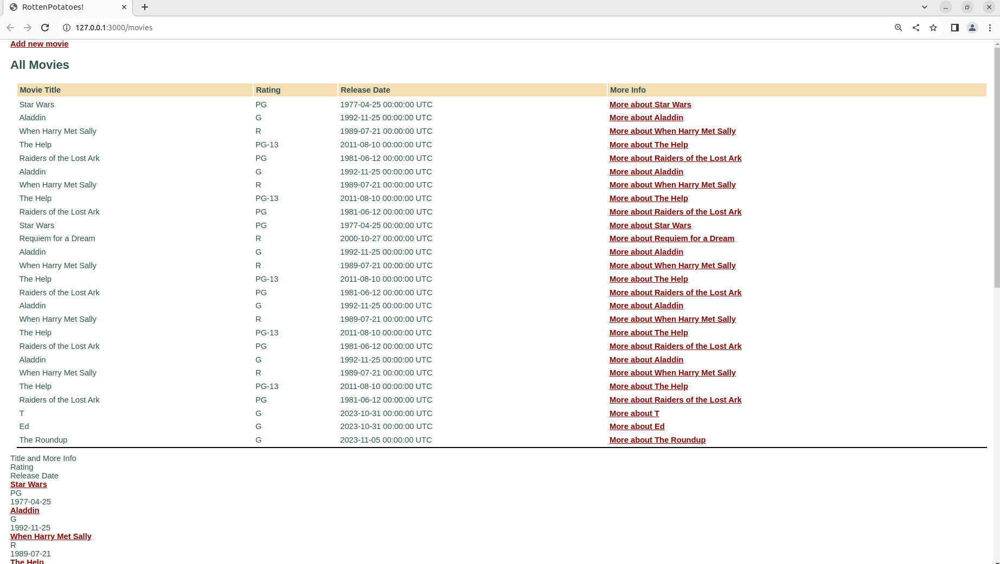

# Rails-Avanzado
Creamos un directorio llamado _Rails-Avanzado_, luego clonamos el repositorio de la [actividad](https://github.com/kapumota/Desarrollo-software-2023/tree/main/Semana7/myrottenpotatoes), nos interesa la carpeta llamada ```myrottenpotatoes```. Esta carpeta contiene varias carpetas y archivos, entre los cuales el archivo Gemfile. Nos dirigimos al directorio ```'Rails-Avanzado/myrottenpotatoes'``` desde la terminal y ejecutamos el comando ```bundle install```, luego para iniciar nuestro servidor web local que escucha en un puerto específico (por defecto, el puerto 3000) ejecutamos el siguiente comando ```bin/rails server```, podemos acceder a nuestra aplicación a través de un navegador web visitando [http://localhost:3000](http://localhost:3000).


Error mostrado desde navegador


Error mostrado desde la terminal


El error mostrado es ```ActiveRecord::StatementInvalid in MoviesController#index```, además nos especifica donde posiblemente se encuentra el error (```app/controllers/application_controller.rb:11:in `set_current_user'```). Al dirigirnos al archivo ```'app/controllers/movies_controller.rb'``` observamos que el método index de la clase MoviesController tiene la siguiente línea ```@movies = Movie.all```, para corregir este error, vamos a cambiar Moviegoer por Movie en el método ```set_current_user``` en el archivo ```application_controller.rb```


Visualizamos que el error ha cambiado, ahora es un error de sintaxis. Este problema se encuentra en el archivo ```app/models/movie.rb```


Quitamos los comentarios y ejecutamos nuevamente el servidor.


El error ha sido corregido. Ahora visualizamos las películas y otros datos. También podemos agregar nuevas películas.

## Vistas parciales, validaciones y filtros
### Vistas parciales
Una vista parcial es el nombre de Rails para una parte reutilizable de una vista. Cuando debe aparecer contenido similar en diferentes vistas, colocar ese contenido en una parte e “incluirlo” en archivos separados ayuda a DRY la repetición.

Creamos el archivo _movie.html.erb en el directorio app/views/movies e incluimos el siguiente fragmento de codigo (actuará como una vista parcial).

``` ruby
<div class="row">
    <div class="col-8"> <%= link_to movie.title, movie_path(movie) %> </div>
    <div class="col-2"> <%= movie.rating %> </div>
    <div class="col-2"> <%= movie.release_date.strftime('%F') %> </div>
</div>
```
Luego cambiaremos el formato de html.haml a html.erb del archivo ```index.html.haml``` y agregamos el siguiente fragmento de codigo en el archivo ```index.html.erb```

``` ruby
<!--  ...other code from index.html.erb here... -->
<div class="row bg-dark text-white">
    <div class="col-6 text-center">Title and More Info</div>
    <div class="col-2 text-center">Rating</div>
    <div class="col-4 text-center">Release Date</div>
</div>
<%= render partial: 'movie', collection: @movies %>
```

**IMPORTANTE:** para agregar la vista parcial del archivo llamado ```_movie.html.erb``` en ```<%= render partial: 'movie', collection: @movies %>``` se escribe el nombre sin guión bajo ni la extension .html.erb (movie).

Ejecutamos nuevamente el servidor y se sigue observando las tablas y no arroja ningún error



### Validaciones
Las validaciones de modelos, al igual que las migraciones, se expresan en un mini-DSL integrado en Ruby, como muestra en el siguiente código. Escribe el código siguiente en el código dado en ```app/models/movie.rb```

``` ruby
class Movie < ActiveRecord::Base
    def self.all_ratings ; %w[G PG PG-13 R NC-17] ; end #  shortcut: array of strings
    validates :title, :presence => true
    validates :release_date, :presence => true
    validate :released_1930_or_later # uses custom validator below
    validates :rating, :inclusion => {:in => Movie.all_ratings},
        :unless => :grandfathered?
    def released_1930_or_later
        errors.add(:release_date, 'must be 1930 or later') if
        release_date && release_date < Date.parse('1 Jan 1930')
    end
    @@grandfathered_date = Date.parse('1 Nov 1968')
    def grandfathered?
        release_date && release_date < @@grandfathered_date
    end
end
```

y comprueba tus resultados en la consola, para esto usaremos la consola de comandos de ruby, ejecutaremos el comando rails console.

```
m = Movie.new(:title => '', :rating => 'RG', :release_date => '1929-01-01')
# force validation checks to be performed:
m.valid?  # => false
m.errors[:title] # => ["can't be blank"]
m.errors[:rating] # => [] - validation skipped for grandfathered movies
m.errors[:release_date] # => ["must be 1930 or later"]
m.errors.full_messages # => ["Title can't be blank", "Release date must be 1930 or later"]
```

Vemoos que las salidas son las esperadas 


