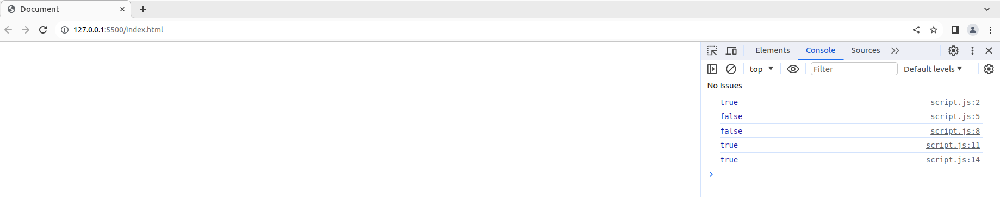
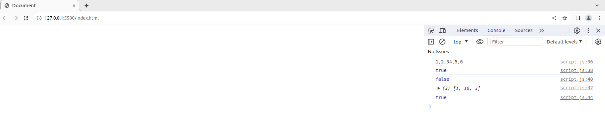
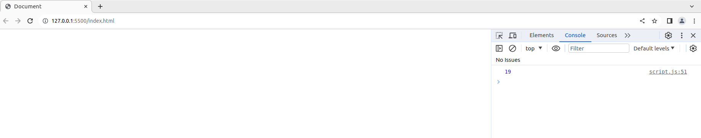

# Java Script
## Preguntas conceptuales
* ```En JavaScript, todas las operaciones de red son asíncronas. ¿Por qué es esto importante?```
En JavaScript, el entorno de ejecución de JavaScript se ejecuta en un solo hilo. Las razones importantes por las cuales las operaciones de red son asíncronas en JavaScrip son: Evitar el bloqueo del hilo principal, mejorar la eficiencia y la capacidad de respuesta, manejar múltiples operaciones concurrentes, programación no bloqueante y manejar retrasos de red.

* ```En Javascript, queremos realizar acciones tras una operación/solicitud de red completa. ¿Qué paradigma de programación hace esto posible?```
El paradigma de programación que permite realizar acciones tras una operación o solicitud de red completa de manera eficiente es el paradigma programación asíncrona. Se basa en la ejecución de código sin bloquear el hilo principal, con lo cual el programa puede continuar ejecutándose mientras espera que se complete una operación asíncrona, como una solicitud de red.

* ```¿Javascript proporciona soporte limitado para la herencia a través de qué mecanismo?```
Los prototipos son el mecanismo que usa JavaScript para lograr la herencia. Cada objeto en JavaScript tiene un prototipo, y cuando se busca una propiedad en un objeto y no se encuentra, JavaScript busca la propiedad en su prototipo, y así sucesivamente en la cadena de prototipos hasta que se encuentra la propiedad o se llega al final de la cadena.
  
* ```¿Qué es el DOM? ¿Qué librería nos ayuda a usar Javascript para manipular el DOM?```
El DOM (Document Object Model) es una interfaz de programación para documentos HTML y XML. El DOM representa la estructura lógica de un documento y la forma en que los programas pueden acceder, modificar y manipular dinámicamente el contenido de un documento web. **El DOM organiza la estructura del documento en una jerarquía de nodos**, donde **cada nodo representa** una parte del documento, como **elementos HTML, atributos, texto, etc.**

 ## ¿Qué haría Javascript?
 ### ```Booleano```
 Hay siete valores "Falsy" en Javascript. "Falsy" significa que se evalúan como falso en condicionales: 
 * 0 (Number)
 * 0n (BigInt)
 * null (palabra clave)
 * undefined (palabra clave)
 * false (Booleano)
 * NaN (Number)
 * "" (String)
Sin embargo, estos valores no son necesariamente iguales entre sí.
Para verificar tu comprensión, completa estas preguntas:
* ```undefined == null```
undefined es igual a null, por lo tanto devolverá true

* ```NaN == NaN```
NaN no es igual a NaN, por lo tanto devolverá false

* ```null == false```
null no es igual a false, por lo tanto devolverá false

* ```0 == false```
0 es igual a false, por lo tanto devolverá true
  
* ```"" == false```
Una cadena vacía es igual a false, por lo tanto devolverá true

```javascript
// undefined es igual a null
console.log(undefined == null); // Imprimirá true

// NaN no es igual a NaN
console.log(NaN == NaN); // Imprimirá false

// null no es igual a false
console.log(null == false); // Imprimirá false

// 0 es igual a false
console.log(0 == false); // Imprimirá true

// Una cadena vacía es igual a false
console.log("" == false); // Imprimirá true
```


¡Las comparaciones booleanas son complicadas!
1) Recomendamos usar métodos de comparación integrados en lugar de == o ===
2) Evita comparar diferentes tipos.
3) Convierte explícitamente los tipos a Booleanos cuando sea necesario.

Usando métodos de comparación integrados
```javascript
// undefined es igual a null
console.log(Object.is(undefined, null)); // Imprimirá false

// NaN no es igual a NaN
console.log(Number.isNaN(NaN)); // Imprimirá true

// null no es igual a false
console.log(Object.is(null, false)); // Imprimirá false

//0 es igual a false
console.log(Boolean(0) === false); // Imprimirá true

// Una cadena vacía es igual a false
console.log(Boolean("") === false); // Imprimirá true
```

 ### ```Arrays```
* ```[1, 2, 3] + [4, 5, 6]```
JavaScript trata los arrays como cadenas y concatena sus elementos, por lo que el resultado de esta operación será "1,2,34,5,6".

* ```!![]```
Doble negación de un array, retorna true

* ```[] == true```
Comparación de un array con true, un array vacío en JavaScript se evalúa como true en un contexto booleano, por lo tanto retorna true

* ```[10, 1, 3].sort()```
La función sort convierte los elementos a cadenas antes de ordenarlos, por lo que el resultado no es lo esperado ([1, 3, 10]). En este caso, el resultado sería [1, 10, 3].
  
* ```[] == 0​```
JavaScript realiza una serie de conversiones automáticas antes de realizar la comparación, al convertir un array vacío ([]) a número da como resultado 0, por lo tanto retorna true la comparacion

```javascript
console.log([1, 2, 3] + [4, 5, 6]);

console.log(!![]);

console.log([] == true);

console.log([10, 1, 3].sort());

console.log([] == 0);
```


 ### ```Clausuras```

```javascript
function f1(x) {
  var baz = 3;
  return function (y) {
    console.log(x + y + (baz++));
    }
}
var bar = f1(5);
bar(11);
```

La variable bar es una funcion con un parametro (y), primero la funcion f1 recibe el argumento 5, lo cual retorna la funcion interna (con valores: baz = 3, x = 5), luego al llamar a la funcion bar con argumento 11, esta funcion retorna en consola el valor de la suma de x + y + baz, es decir retorna 19 (y = 11).



 ### ```Algoritmos```
 La siguiente función encuentra el mayor número dentro de un array, pero tiene una eficiencia de O(N2). Reescribe la función para que se convierta en una O(N) más rápida:

 ```javascript
function greatestNumber(array) {
  for (let i of array) {
    let isIValTheGreatest = true;
    for (let j of array) {
      if (j > i) {
        isIValTheGreatest = false;
      }
    }
    if (isIValTheGreatest) {
      return i;
    }
  }
}
```
La función reescriba para mejorar la eficiencia, es decir que tenga O(N):

 ```javascript
function greatestNumber(array) {
    if (array.length === 0) {
      return undefined; 
    }
  
    let maxNumber = array[0]; 
  
    for (let i = 1; i < array.length; i++) {
      if (array[i] > maxNumber) {
        maxNumber = array[i]; 
      }
    }
    return maxNumber;
}

// ejemplo de uso de la funcion
const numbers = [3, 7, 2, 9, 5];
console.log(greatestNumber(numbers)); // Imprimirá 9
 ```


 ### ```Clases```
  
